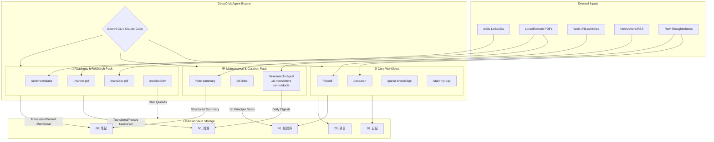
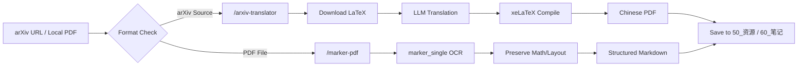
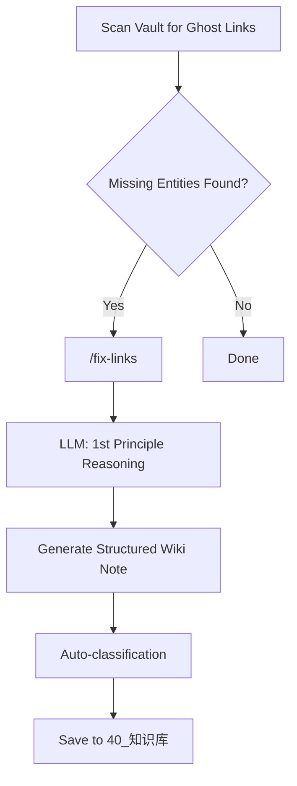
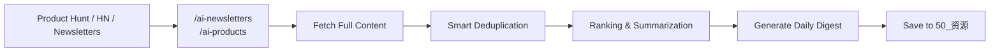

# DeepOrbit Architecture & Workflows

This document visualizes the core architecture and specialized workflows of **DeepOrbit**, an agent-driven Digital Research Assistant built on top of Obsidian and Gemini CLI / Claude Code.

## 1. Overall System Architecture: DeepOrbit Engine

This diagram illustrates how raw inputs (URLs, Papers, PDFs, Ideas) are ingested by AI Agents, processed through specialized skill packs, and finally structured into the Obsidian local vault.

---

## 2. Detailed Workflows: Academic & Research

### 🎓 `/arxiv-translator` & `/marker-pdf`
DeepOrbit automates the heavy lifting of parsing and translating complex academic papers.

---

## 3. Detailed Workflows: Knowledge Maintenance

### 🔗 `/fix-links` (Ghost Link Fixer)
This skill ensures your Obsidian Wiki never has dead ends by automatically generating content based on first principles.

### 📰 Content Curation Pipelines
Automated curation of industry news and product launches.

