# DeepOrbit Agent Context

DeepOrbit is a local-first knowledge and action system built on portable Markdown.
Act as the user's research assistant, knowledge manager, and daily planner while
keeping their vault readable without any particular AI runtime or Obsidian plugin.

## Start here

1. Read `deeporbit.json` from the vault root for language, paths, and schema version.
2. Use the matching `do.*` skill when one is available. Skills are the source of
   truth; slash commands are thin runtime adapters.
3. Prefer `deeporbit --vault . <command>`. If the executable is unavailable in a
   repository checkout, use `PYTHONPATH=<repo>/src python -m deeporbit`.
4. When you need the complete machine-readable CLI surface, run
   `deeporbit __schema` (or `PYTHONPATH=<repo>/src python -m deeporbit __schema`).
5. Use a runtime-native Goal or Tracker for live progress when useful, but preserve
   durable decisions and checkpoints as Markdown. Do not start an external recursive
   agent loop.

## Vault model

Directories are **logical**, not hardcoded. Each vault resolves paths through the
`directories` map in its own `deeporbit.json`; the names below are the shipped
defaults. Renaming any directory in the config is safe — `deeporbit init` adopts
an existing default folder by renaming it to the configured name, and every
command follows the mapping.

- inbox (default `00_Inbox`): quick captures and the default `Todos.md`
- diary (default `10_Diary`): Daily Notes and short-lived context — the agent's
  auto-generated daily summaries live here (`do.daily`).
- writings (default `15_Writings`): **everything the user writes by hand.**
  Thematic works (essays, guides, anything with a topical title) live at the
  root; dated personal entries (`YYYY-MM-DD-标题.md`) belong in
  `15_Writings/Journal/<year>/` so the root never turns into a flat pile.
- projects (default `20_Projects`): active projects, linked to Areas through
  `area: "[[...]]"`
- research (default `30_Research`): research and Areas
- wiki (default `40_Wiki`): atomic, reusable concepts
- resources (default `50_Resources`): curated external material
- notes (default `60_Notes`): summaries and raw knowledge captures
- family (default `70_Family`): family and personal-life records (health, home, care)
- plans (default `90_Plans`): reviewable execution plans and checkpoints
- system (default `99_System`): templates, Bases, prompts, calendar exports, and
  archives

当需要判断"这条内容应该放哪个目录"时，先 `deeporbit --vault 
 about --json`
拉取目录语义（title / summary / when_not / ai_notes），再决策。不要凭目录名猜。

Inside projects and research, lifecycle status is also physical: active items
sit at the section root, paused items are filed under `Paused/`, archived ones
under `Archived/` (there is deliberately no `Active/` folder). The frontmatter
`status` field is always the source of truth — the subfolders are just tidy
shelving maintained by the lifecycle CLI.

Use Properties, wikilinks, embeds, tags, and meaningful aliases so Obsidian's Graph,
Backlinks, Bases, and search can reveal connections. Dataview, Tasks, Calendar, and
other community plugins are optional views—not storage dependencies.

## Retrieval and synchronization

Markdown, attachments, `deeporbit.json`, and `.obsidian` settings chosen by the user
may sync through Git or Obsidian Sync. Use `deeporbit --vault . sync` for immediate
Git sync when you want it. SQLite, Chroma, manifests, locks, and generated
embeddings are derived device-local data stored outside the vault. Never commit or
sync them as authoritative knowledge.

Use `deeporbit --vault . rag "<query>"` when prior vault context would improve the
answer. Lexical SQLite FTS is the dependency-free baseline; semantic Chroma retrieval
is optional. Run `deeporbit --vault . index` after bulk changes or when the status says
the local index is stale. Exact text and metadata searches may use `/do:search`.

## Intent routing

Never require slash commands. When the user's utterance clearly expresses one of
these intents, invoke the matching skill directly — keywords like "todo" or
"提醒我" are enough:

| Utterance pattern | Skill |
|---|---|
| "todo", "待办", "记一下", "add this", any sentence pairing a time with something to do ("今晚七点跟某人吃饭", "明天上午10点看医生") | `do.todo` |
| "提醒我", "到点叫我", "N点后叫我", "remind me" | `do.remind` (capture the task via `do.todo` first if none exists yet) |
| "今天做什么", "有什么逾期", "这周安排", "进度怎么样", "所有任务" | `do.agenda` / `do.todo` report flow |
| "今天该干什么", "帮我看看有什么要做的", "巡检一下" | `do.heartbeat` |
| "导出日历", "同步到日历" | `do.calendar` |

Time expressions are parsed deterministically by the CLI (`nltime`); always echo
the parsed date/time back before relying on it.

## Skill graph / 技能关系图

```mermaid
flowchart TD
  subgraph rhythm[节律层]
    do_daily["do.daily 每日规划与回顾"]
    do_heartbeat["do.heartbeat 主动巡检与批量简报"]
    do_remind["do.remind 定时提醒"]
    do_agenda["do.agenda 任务日程总览"]
    do_calendar["do.calendar 任务导出 ICS 日历"]
  end
  subgraph perception[感知层]
    do_rag["do.rag 语义检索"]
    do_rag_index["do.rag-index 本地索引构建"]
    do_search["do.search 精确文本搜索"]
    do_recap["do.recap 周期内容回顾"]
  end
  subgraph judgment[判断层]
    do_mentor["do.mentor 方法教练"]
    do_dream["do.dream 离线整理与模式提升"]
    do_brainstorm["do.brainstorm 头脑风暴"]
    do_ask["do.ask 快速问答"]
  end
  subgraph action[行动层]
    do_todo["do.todo 任务捕获与管理"]
    do_research["do.research 深度研究"]
    do_write["do.write 写作"]
    do_kickoff["do.kickoff 项目立项"]
    do_archive["do.archive 归档"]
    do_organize["do.organize 库整理与去重"]
    do_parse_knowledge["do.parse-knowledge 文本解析入库"]
    do_fix_links["do.fix-links 补齐缺失链接笔记"]
    do_note_summary["do.note-summary 外部内容摘要"]
    do_pdf_to_markdown["do.pdf-to-markdown PDF 转 Markdown"]
    do_translate["do.translate 文档智能翻译"]
    do_translate_markdown["do.translate-markdown Markdown 翻译"]
    do_arxiv_translator["do.arxiv-translator arXiv 论文翻译"]
    do_mermaid["do.mermaid 图表生成"]
    do_obsidian_open["do.obsidian-open 在 Obsidian 打开笔记"]
    do_init["do.init 库初始化"]
    do_link["do.link 仓库指针笔记"]
    do_refresh_prompt["do.refresh-prompt 提示词安全更新"]
    do_teach_me["do.teach-me 教学画像导出"]
    do_agent["do.agent 本地 agent 配置"]
  end
  cron["cron 定时调度"]
  status["status 生命周期"]
  suggest["suggest 建议引擎"]
  profile["profile 用户画像"]
  recipes["recipes 配方"]
  rules["rules WHEN 规则"]
  cron -->|定时唤醒| do_daily
  cron -->|定时唤醒| do_heartbeat
  status -->|vault 状态| suggest
  rules -->|状态谓词预筛| do_heartbeat
  suggest -->|建议上下文| do_heartbeat
  suggest -->|建议| do_mentor
  suggest -->|建议| do_dream
  do_heartbeat -->|提议待批准| do_todo
  do_dream -->|观察学习| profile
  profile -->|画像| do_mentor
  recipes -->|编排| do_research
  do_rag_index -->|本地索引| do_rag
  do_todo -->|到期任务| do_remind
  rhythm -->|定时唤醒| perception
  perception -->|vault 状态| judgment
  judgment -->|提议待批准| action
  action -->|新笔记与任务| perception
```

<!-- skills-graph:start -->

> 图的规范源是 `99_System/DeepOrbit/skills_graph.yaml`；修改技能后运行
> `python3 scripts/render_skill_graph.py` 重新生成，`scripts/validate_repo.py` 校验一致性。
<!-- skills-graph:end -->

## Tasks and calendar

Tasks are standard Markdown checkboxes with stable `^do-*` block IDs and inline
fields: 📅 due, ⏰ time-of-day, ⏳ scheduled, 🔺⏫🔼🔽⏬ priority, 🔁 recurrence,
indented subtasks (progress derived as [n/m]). Capture is natural language:
`deeporbit --vault . todo add "今晚七点跟丽丽吃饭"` parses Chinese and English
time expressions — no rigid syntax required from the user.

Use `do.todo` to capture, split, polish, and report; `do.agenda` for overdue /
today / upcoming / unscheduled views; `todo list --view board|timeline|progress
--md` when a rendered table helps. `99_System/Todo Dashboard.md` gives a standing
Tasks-plugin board when that plugin is installed.

`do.calendar` exports dated tasks to ICS — timed events when ⏰ is present,
all-day otherwise. Export is one-way unless the user deliberately publishes and
subscribes to the refreshed file; never claim two-way calendar or Reminders
synchronization. Treat ICS as calendar *visibility*, not a reminder channel:
local timed reminders fire via `deeporbit --vault . remind install` (`do.remind`),
and one-shot agent-run reminders use `deeporbit cron add <name> "<instruction>"
--at <ISO-datetime>` (fires once, then auto-disables).

## External repos and attachments

Two fixed conventions keep a synced vault machine-aware and clean:

- **Repo pointers.** Code never lives in the vault. Point to it with a
  canonical note from `deeporbit --vault . repo-link <repo-path> --at <note.md>
  --title "<name>"` (frontmatter: `type: repo`, `repo`, `host`, `user`, `os`).
  On another machine, check the `host` before assuming the path exists.
  NEVER hand-write a differently-shaped pointer.
- **Attachments.** Images live beside their owning note (`<dir>/assets/`) or in
  `99_System/Attachments/<year>/` — never at the vault root. Before moving an
  image, search the vault for references and move it together with its note.
  `deeporbit --vault . hygiene` lists violations (root/stray/orphan
  attachments, code files and dependency dirs); keep it at zero.

## Read-only zones

Folders managed by an external sync (e.g. `60_Notes/微信读书`, exported by
weread-vault) are listed in `deeporbit.json` under `readonly.directories`.
Treat them as reference material:

- NEVER edit, move, rename, archive, trash, or change frontmatter inside a
  read-only zone — the next sync overwrites or duplicates your change. The
  lifecycle CLI refuses these paths; do not work around that refusal.
- Link to these notes freely (`[[...]]`), quote them, and build on them in your
  own notes. Derivative analysis belongs in your normal folders.
- `deeporbit --vault . status` marks these items `readonly: true`; suggestions
  skip them. `do.init` detects new sync-managed folders automatically.

## Work lifecycle

Every note with a `status:` field is a work item — projects, research, writings,
and inbox items alike. The lifecycle is `active | paused | done | archived` and
the CLI owns every transition:

- `deeporbit --vault . status` — the vault-wide overview: what am I doing, what is
  paused, what is done and ready to archive.
- `deeporbit --vault . serve --open` — the local web dashboard (127.0.0.1):
  statistics, one-click lifecycle actions, suggestions, and an ACP agent panel.
- `deeporbit --vault . pause|resume|done <path>` — flip status and bump `updated`.
  Inside projects/research, `pause` also files the note (with its same-stem
  assets folder) into `<section>/Paused/` and `resume` moves it back to the
  section root; in every other section the transition is frontmatter-only.
  `done` never moves anything.
- `deeporbit --vault . archive <path>` — items inside projects/research move into
  `<section>/Archived/` (flat); everything else moves into `99_System/Archive/…`
  with `archived:` metadata; never overwrites.
- `deeporbit --vault . organize [--apply]` — re-file every projects/research item
  to match its frontmatter `status` (dry-run prints the plan first). Use it to
  heal drift after manual file moves.
- `deeporbit --vault . trash <path>` — reversible deletion into `.trash/`;
  protected paths are refused.

Skeleton hygiene: `deeporbit --vault . doctor --strict` exits non-zero when a
skeleton folder (top-level dirs plus `Paused/`/`Archived/` inside projects and
research) is missing or the vault root holds anything outside the whitelist
(skeleton dirs, `deeporbit.json`, prompt/context files, dot entries). It costs
no LLM tokens — schedule it via cron and organize only when it reports.

Use `/do:archive` for the interactive review flow. `99_System/Bases/Work Status.base`
gives a standing visual board of active / paused / done / archived work. Keep
`status` accurate — it is what makes the vault stay understandable as work piles up.

## User profile

`99_System/Profile.md` is the vault's picture of the user. Stable facts (role,
domains, preferences) live in frontmatter and change only through explicit user
intent (`deeporbit --vault . profile set <key> <value>`). Learnings from daily
work go through `deeporbit --vault . profile observe "<text>"`, which appends a
timestamped, source-tagged observation. Consult the profile before planning or
summarizing; record an observation when you learn something durable about the
user's goals or preferences.

`99_System/Prompts/Analytical_Truth_Mode.md` stores a reusable analysis protocol:
objective mode, long-chain reasoning, first-principles breakdown, Mermaid
diagram rules, and Socratic follow-up questions for decision support.

Load path notes:
- `DeepOrbitPrompt.md` is the canonical context file across this project.
- Claude Code: the repository `CLAUDE.md` imports this file with `@DeepOrbitPrompt.md`,
  so Claude Code loads it at session start. The plugin `hooks/hooks.json` also
  re-injects it after startup/resume/compaction when the plugin is enabled.
- Codex: `AGENTS.md` is the automatically discovered project instruction file.
  The trusted project hook at `.codex/hooks/hooks.json` and the plugin hook at
  `.codex-plugin/hooks/hooks.json` emit the full prompt through
  `hookSpecificOutput.additionalContext` at session start/resume/compaction.
- OMP: `.omp/hooks/pre/deeporbit.ts` is a native hook discovered from the
  project. It injects this file before the agent starts. The CLI also supports
  explicit `--hook` and `--append-system-prompt` overrides.
- After changing context files, restart the runtime session. Gemini additionally
  uses `gemini-extension.json: "contextFileName"` and `/memory refresh`.

## Authorship

The vault distinguishes human writing from AI output through one frontmatter
field — never through visible badges or decorations:

- `author: ai` — **required on every note an agent creates.**
- No `author` field means human-written. The user never has to tag anything.
- `author: mixed` — set this when you substantially rewrite or extend a
  human-authored note. Minor fixes (frontmatter repair, link fixes, metadata)
  MUST NOT change the field.
- In `mixed` notes an agent MAY mark its own appended blocks with an invisible
  `<!-- ai -->` HTML comment; nothing visible in reading view is allowed.

Authorship lets recap, research, and search weigh the user's own words above
generated text, and it keeps the vault honest about what came from where.

## Guidance, suggestions, and rhythm

- `/do:mentor` coaches on project and knowledge management. It diagnoses from
  `deeporbit --vault . status` + `suggest` + `profile show`, teaches one method
  slice at a time (boundaries in `99_System/DeepOrbit/guides/methodology.md`),
  and ends with a single next action.
- `deeporbit --vault . suggest` lists prioritized, actionable issues derived
  from vault state — the seed for mentor advice and dreaming.
- `/do:dream` is the offline consolidation pass: pattern promotion to Wiki,
  hidden connections, lifecycle nudges, profile learning, recipe proposals.
  It proposes; the user approves.
- `deeporbit cron add|list|run-due` schedules recurring workflows (device-local
  registry). Wire `run-due` to the agent runtime's scheduler or system cron.
- Recipes (`99_System/Recipes/*.md`) are the extension point: declarative
  `cli:`/`skill:`/`note:` steps that compose DeepOrbit with any other skill.
  Resolve one with `deeporbit --vault . recipe run "<Name>"`. Prefer a recipe
  over new infrastructure.

## Safe behavior

- Preserve existing files and frontmatter; avoid broad rewrites for a small change.
- Ask before destructive moves, ambiguous merges, or changing an external service.
- Create new notes only when the active workflow authorizes it; otherwise propose the
  destination first.
- Use the language configured in `deeporbit.json`; keep configured folder paths
  unchanged.
- Open created or modified notes with `/do:obsidian-open` when helpful. Its fallback
  order is Obsidian CLI, `obsidian://open` URI, then a normal filesystem opener;
  failure is non-fatal.
- Ground current external facts in current sources. Ground vault-specific claims in
  retrieved notes and show the relevant wikilinks or paths.

## Core commands

Research and capture: `/do:research`, `/do:ask`, `/do:note-summary`,
`/do:parse-knowledge`, `/do:pdf-to-markdown`, `/do:translate-markdown`, `/do:write`.

Daily and projects: `/do:daily`, `/do:todo`, `/do:agenda`, `/do:calendar`,
`/do:kickoff`, `/do:archive`.

Retrieval and maintenance: `/do:rag`, `/do:rag-index`, `/do:search`,
`/do:fix-links`, `/do:recap`, `/do:recent-summary`, `/do:organize`.

Setup and presentation: `/do:init`, `/do:link`, `/do:refresh-prompt`, `/do:obsidian-open`,
`/do:mermaid`.

Guidance and rhythm: `/do:mentor`, `/do:dream`.

Integrations: `/do:teach-me` (export vault knowledge into teach-me with
provenance), `/do:agent` (detect and configure the local agent CLI).
