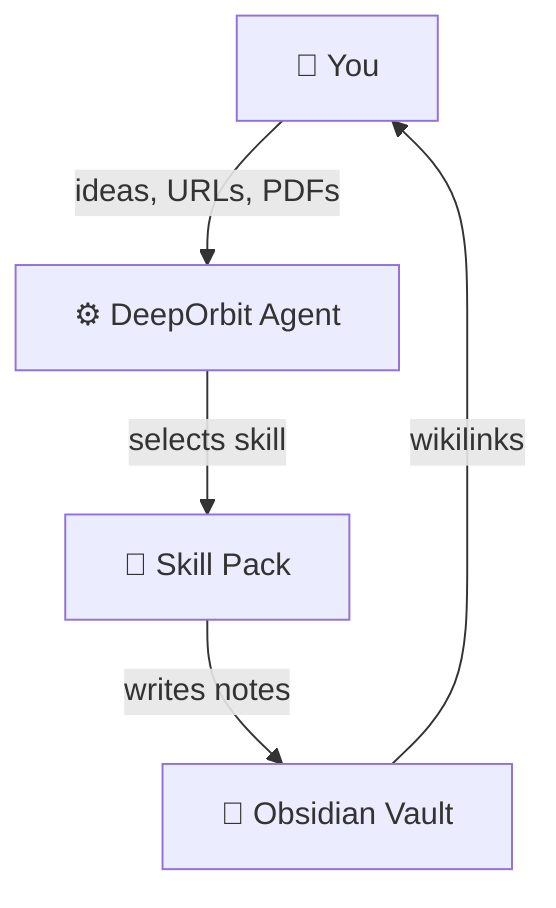
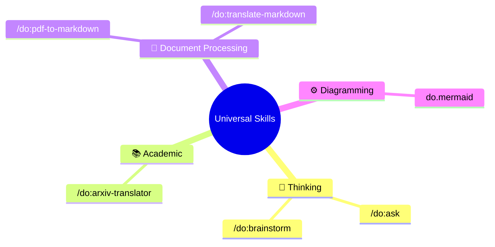
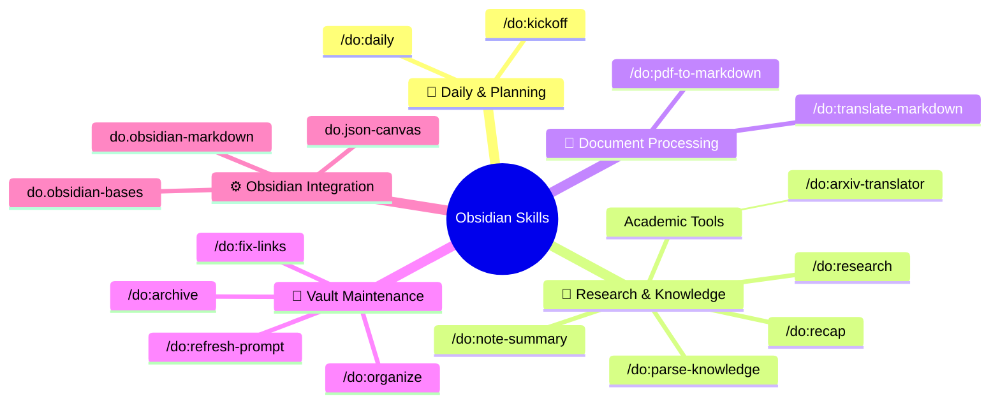
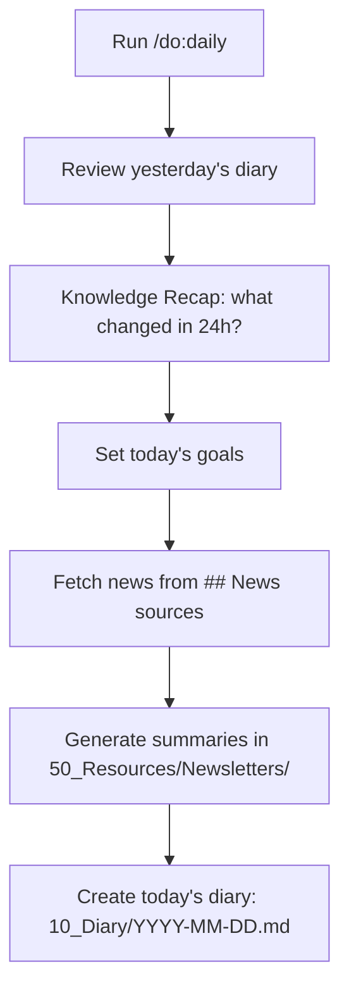
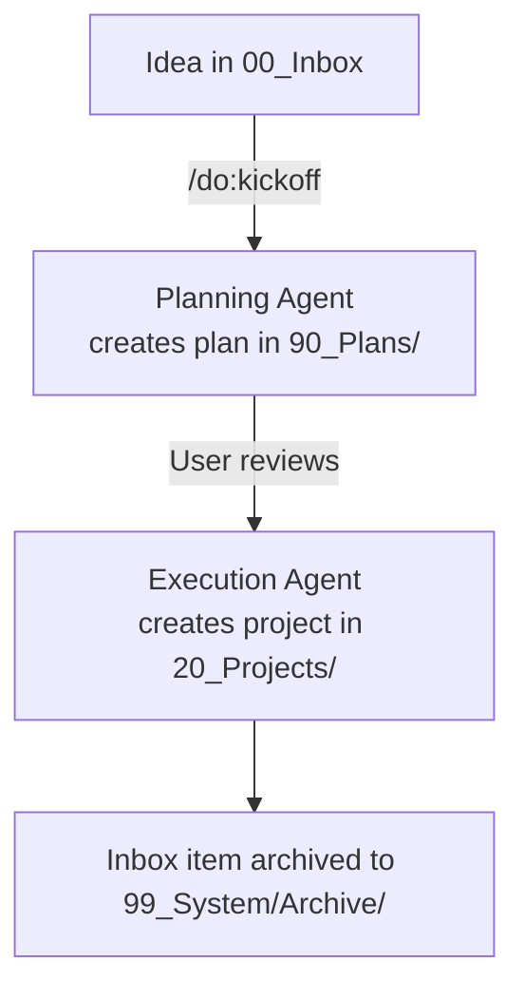
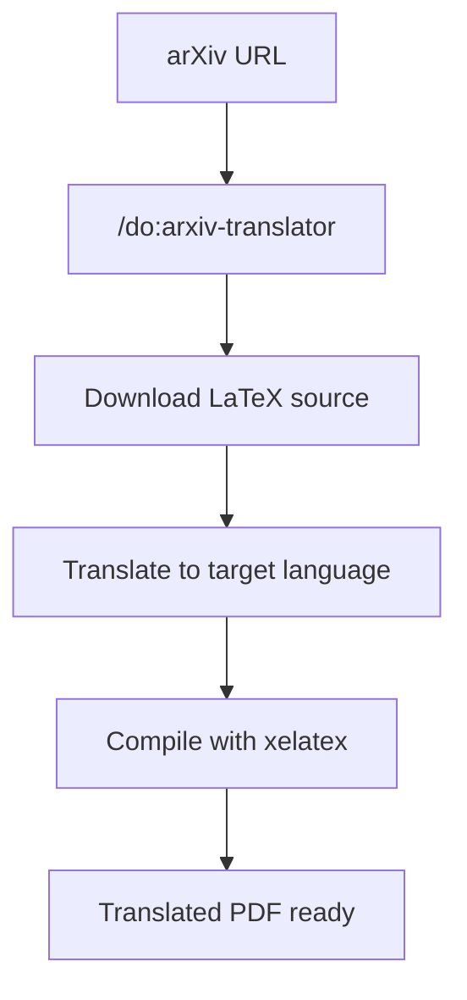
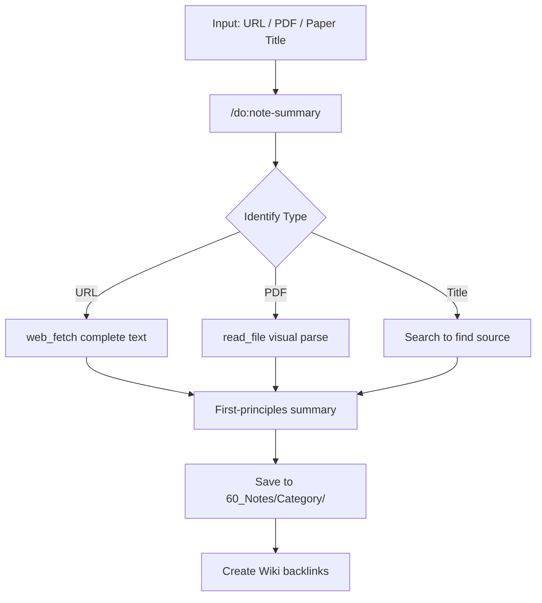

# DeepOrbit


> **An AI-agent system that bridges LLMs with Obsidian to automate deep research and personal knowledge management.**

[**中文文档**](README_CN.md)

DeepOrbit turns your [Obsidian](https://obsidian.md/) vault into an AI-powered research engine. It uses specialized agent skills (via Gemini CLI / Claude Code) to automate deep research, paper translation, content curation, and vault maintenance — so you can focus on thinking, not filing.

> [!IMPORTANT]
> **Obsidian is required.** DeepOrbit's folder structure, wikilink system, and templates all depend on a local Obsidian vault.

🙏 **Acknowledgments**: DeepOrbit is deeply inspired by [OrbitOS by MarsWang42](https://github.com/MarsWang42/OrbitOS). We extend our sincere gratitude for their innovative approach to vault structure and agent-driven workflows.

---

## How It Works



You give DeepOrbit raw inputs — an arXiv link, a PDF, a quick idea, a URL. The Agent Engine routes your request to the right **Skill**, which processes, translates, summarizes, or structures the content and saves it directly into your Obsidian vault with proper metadata and wikilinks.

---

## Quick Start

### Prerequisites

| Tool | Required? | Note |
|------|-----------|------|
| [Obsidian](https://obsidian.md/) | ✅ Yes | Vault management |
| [Gemini CLI](https://github.com/google-gemini/gemini-cli) or [Claude Code (limited support)](https://docs.anthropic.com/en/docs/claude-code) | ✅ Yes | Agent runtime |
| `ralph` | **recommended** | For `/do:pdf-to-markdown` and `/do:translate-markdown` |
| `xelatex` | **recommended** | For `/do:arxiv-translator` |

### Setup (3 steps)

```bash
# 1. Clone the repository
git clone https://github.com/dull-bird/DeepOrbit.git

# 2. Run init in your Obsidian vault
# Windows (PowerShell):
& "$env:USERPROFILE\.gemini\extensions\deeporbit\scripts\init_deeporbit_prompt.ps1" "C:\path\to\your\vault"

# macOS/Linux (Bash):
bash ~/.gemini/extensions/deeporbit/scripts/init_deeporbit_prompt.sh ~/path/to/your/vault

# 3. Initialize in Gemini CLI
/do:init ~/path/to/your/vault
/memory refresh
```

The init script (or `/do:init` command) will:
- Copy `DeepOrbitPrompt.md` and `deeporbit.json` into your vault
- Create all vault folders (see structure below)
- Inject `DeepOrbitPrompt.md` into `.gemini/settings.json`

### Language Configuration

Edit `deeporbit.json` in your vault root to set the AI's interaction language:

```json
{ "language": "zh-CN" }
```

> **Note:** Folder paths always stay in English for stability. Only the AI's responses and generated note content follow this setting.

---

## Vault Structure

```mermaid
flowchart TD
    V["📦 Your Obsidian Vault"]
    
    V --> G1
    V --> G2
    V --> G3

    subgraph G1 ["Captured & Active"]
        node_A["00_Inbox<br/><i>Quick captures</i>"]
        node_B["10_Diary<br/><i>Daily logs</i>"]
        node_C["20_Projects<br/><i>Active projects</i>"]
        node_A ~~~ node_B ~~~ node_C
    end
    
    subgraph G2 ["Knowledge Base"]
        node_D["30_Research<br/><i>Deep dives</i>"]
        node_E["40_Wiki<br/><i>Atomic concepts</i>"]
        node_G["60_Notes<br/><i>Summaries & captures</i>"]
        node_D ~~~ node_E ~~~ node_G
    end
    
    subgraph G3 ["Resources & Support"]
        node_F["50_Resources<br/><i>Newsletters, Product Launches</i>"]
        node_H["90_Plans<br/><i>Execution plans</i>"]
        node_I["99_System<br/><i>Templates & Prompts</i>"]
        node_F ~~~ node_H ~~~ node_I
    end

    style V fill:#1a1a2e,stroke:#16213e,color:#e0e0e0
    style node_A fill:#0f3460,stroke:#16213e,color:#e0e0e0
    style node_B fill:#0f3460,stroke:#16213e,color:#e0e0e0
    style node_C fill:#0f3460,stroke:#16213e,color:#e0e0e0
    style node_D fill:#0f3460,stroke:#16213e,color:#e0e0e0
    style node_E fill:#0f3460,stroke:#16213e,color:#e0e0e0
    style node_F fill:#0f3460,stroke:#16213e,color:#e0e0e0
    style node_G fill:#0f3460,stroke:#16213e,color:#e0e0e0
    style node_H fill:#0f3460,stroke:#16213e,color:#e0e0e0
    style node_I fill:#0f3460,stroke:#16213e,color:#e0e0e0
```



---

## Skills Overview

DeepOrbit ships with **24 pre-configured AI skills**, split into two categories:

### 🌐 Universal Skills (Work Anywhere)

These skills work independently — no Obsidian vault required.



### 📂 Obsidian Skills (Require Vault)

These skills read from or write to the DeepOrbit vault structure.



### Skills Quick Reference

| Command | What it does |
|---------|-------------|
| `/do:daily` | Morning planning: recap yesterday, fetch news, create today's note |
| `/do:kickoff` | Convert an inbox idea into a structured project (two-agent workflow) |
| `/do:research` | Deep dive into a topic → Research notes + Wiki entries (two-agent workflow) |
| `/do:ask` | Quick Q&A without heavy note-taking |
| `/do:brainstorm` | Interactive Socratic brainstorming partner |
| `/do:note-summary` | Auto-fetch URL/file/paper → structured summary + vault archiving |
| `/do:parse-knowledge` | Turn unstructured text into vault-ready Research + Wiki notes |
| `/do:arxiv-translator` | Download arXiv paper → translate LaTeX → compile PDF |
| `/do:pdf-to-markdown` | PDF → Markdown with completeness checklist + image extraction |
| `/do:translate-markdown` | Translate Markdown to target language, section-by-section with verification |
| `/do:organize` | Deep vault reorganization: root hygiene, taxonomy, orphans, metadata |
| `/do:refresh-prompt` | Safely update DeepOrbitPrompt.md with diff comparison + merge options |

---

## Core Workflow Examples

### 🌅 Morning Routine



### 💡 Idea → Project



### 📄 Academic Paper Pipeline



### 📝 Automated Summary & Archiving



---

## Philosophy

> Everything orbits around you. Keep your knowledge in motion, but let the AI agents do the heavy lifting of parsing, translating, summarizing, and maintaining the structural integrity of your ideas.
