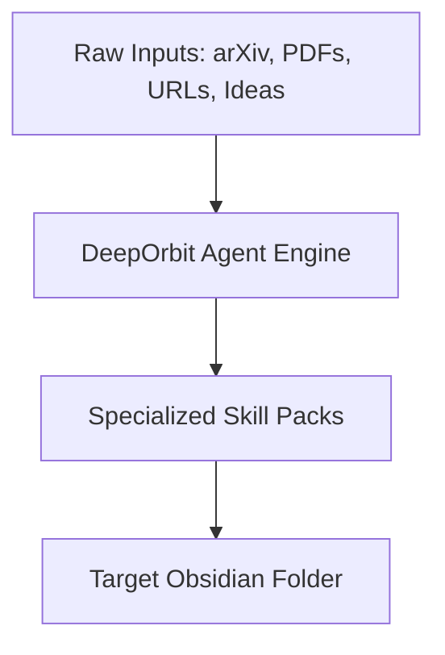
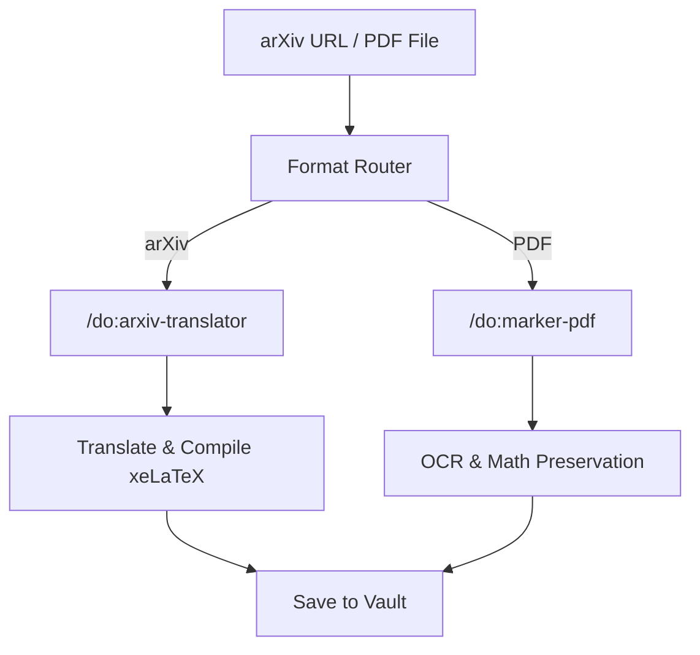
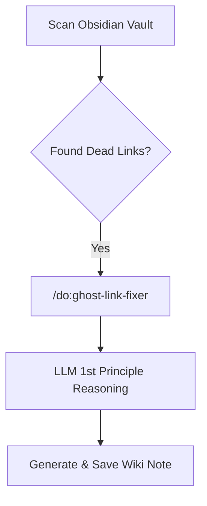

# DeepOrbit


> Not just Personal Knowledge Management. A fully automated, Agent-driven Digital Research Assistant.

DeepOrbit is a highly customized, agent-driven Personal Knowledge Management (PKM) and Research Assistant system designed specifically to work within **Obsidian**. 

> [!IMPORTANT]
> **Obsidian Requirement**
> This repository relies entirely on [Obsidian](https://obsidian.md/) as the underlying note-taking tool. The system architecture, folder mechanisms, and wiki-link structures expect a local Obsidian Vault. You MUST install Obsidian for DeepOrbit to function effectively.

🙏 **Acknowledgments**: DeepOrbit is deeply inspired by and built upon the core philosophy and foundational workflows of [OrbitOS by MarsWang42](https://github.com/MarsWang42/OrbitOS). We extend our sincere gratitude for their innovative approach to vault structure and agent-driven workflows.

While traditional PKM systems focus on manual knowledge entry and linking, **DeepOrbit** is supercharged with specialized AI agents (via Gemini CLI / Claude Code) that automate deep research, literature translation, content curation, and structural maintenance.

---

## 🗺️ Architecture & Workflows Overview

DeepOrbit acts as an engine that takes raw inputs (URLs, Papers, PDFs, Ideas) and processes them through specialized AI Skill Packs, finally structuring the output directly into your Obsidian local vault.

### 1. Ingestion & Processing



- **Inputs**: arXiv links, local/remote PDFs, web URLs, newsletters, or raw ideas from your Inbox.
- **Agent Engine**: A suite of specialized agents handles different types of inputs. Depending on the source, the engine translates, OCRs, summarizes, or structures the data.
- **Storage**: The processed information is saved into designated folders in your Obsidian Vault (e.g., `projects_folder`, `notes_folder`, `resources_folder`) based on your global language configurations in `deeporbit.json`.

### 2. Academic & Research Workflows



- **arXiv & PDF Translation**: Tools like `arxiv-translator` download LaTeX sources, translate to your target language (e.g., Chinese/English), and compile fully formatted PDFs. `marker-pdf` converts PDFs into structured Markdown while preserving complex math formulas.

### 3. Knowledge Maintenance loops



- **Ghost Link Fixer**: Scans your vault for dead wikilinks and automatically queries the LLM to write high-quality foundational notes to fill the knowledge gaps.
- **Content Pipelines**: Scheduled processes fetch news, deduplicate articles, rank them, and summarize them into curated daily digests.

---

## 🚀 Core Features & AI Skill Packs

DeepOrbit offers a powerful suite of over 20 pre-configured AI Agent Skills located in the `skills/` directory.

### 🧠 Academic & Research Pack
- **`/do:arxiv-translator`**: Fetches arXiv LaTeX sources, translates papers preserving math, and compiles to PDF using `xelatex`.
- **`/do:marker-pdf`**: High-fidelity PDF to Markdown conversion (powered by `marker`), tuned for complex math.
- **`/do:translate-pdf`**: Translates PDF documents while preserving the original layout, structure, colors, and styling.
- **`/do:notebooklm`**: Queries Google NotebookLM via browser automation for grounded, hallucination-free answers.

### 🕸️ Knowledge Maintenance & Curation
- **`/do:note-summary`**: Fetches full text from URLs or local files and summarizes into your notes.
- **`/do:ghost-link-fixer`**: Scans your vault for empty wikilinks and auto-generates first-principle Wiki notes.
- **`/do:ai-research-digest` / `/do:ai-newsletters` / `/do:ai-products`**: Automated pipelines to fetch, summarize, and deduplicate daily AI news and products.
- **`/do:archive`**: Clears out completed or old projects/inbox items by archiving them safely.
- **`/do:organize` / `/do:recap`**: Summarizes vault activities and organizes notes logically.

### ⚙️ Core Workflows (Project Management)
- **`/do:kickoff`**: Instantly convert an inbox idea into a structured, active Project folder.
- **`/do:start-my-day`` / `/do:daily`**: Guided morning planning workflows to review diaries, fetch news, and align tasks.
- **`/do:research`**: Deep dive into any topic with a two-agent architecture outputting structured Wiki entries.
- **`/do:parse-knowledge`**: Consolidates unstructured text blobs into your vault's framework.
- **`/do:brainstorm` / `/do:ask`**: Collaborate with your AI assistant on ideas or ask quick questions without heavy note-taking.

### 🔧 Obsidian Technical Integrations
- **`do.obsidian-markdown` / `do.obsidian-bases` / `do.json-canvas`**: specialized agents to interface natively with Obsidian features like Canvas, Markdown formatting specs, and Data structures.

---

## 🛠️ Installation & Setup

1. **Prerequisites**: 
   - [Obsidian](https://obsidian.md/) (CRITICAL for vault management).
   - Gemini CLI or Claude Code.
   - Additional local tools for specific skills (e.g., `xelatex` for `arxiv-translator`, `playwright` for `notebooklm`, `marker` for `marker-pdf`).
2. **Clone the repository**:
   ```bash
   git clone https://github.com/dull-bird/DeepOrbit.git
   ```
3. **Global Configuration**:
   - Locate `deeporbit.json` in the project root. This file controls your core preferences:
     - `language`: Sets the AI's default language (e.g., `zh-CN`, `en`).
     - `folder_mapping`: Defines what Obsidian folders correspond to (e.g., inbox, diary, projects, wiki). All AI skills dynamically read from these locations.
4. **Init prompt in a vault**:
   In your Obsidian vault (or any workspace), run `/do:init` using the scripts found in `scripts/`.
   - Windows: `scripts\init_deeporbit_prompt.ps1`
   - Linux/macOS: `scripts/init_deeporbit_prompt.sh`
   This script reads `deeporbit.json`, copies `DeepOrbitPrompt.md` to your workspace, sets up all necessary Obsidian folders, and injects context into `.gemini/settings.json`.

5. **Load Skills**:
   In your CLI configuration file (`AGENTS.md`), point the skill locations to the cloned `skills` directory. Commands are invoked as `/do:<command_name>`.

---

## 🌌 Philosophy

Everything orbits around you. Keep your knowledge in motion, but let the AI agents do the heavy lifting of parsing, translating, summarizing, and maintaining the structural integrity of your ideas.
