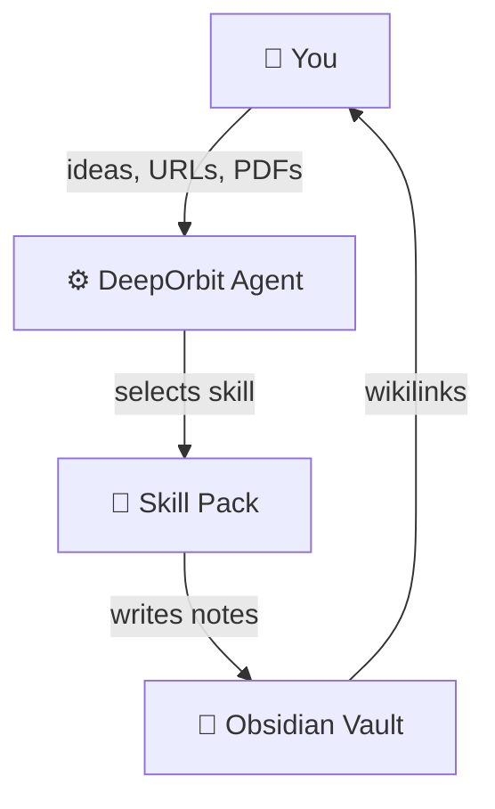
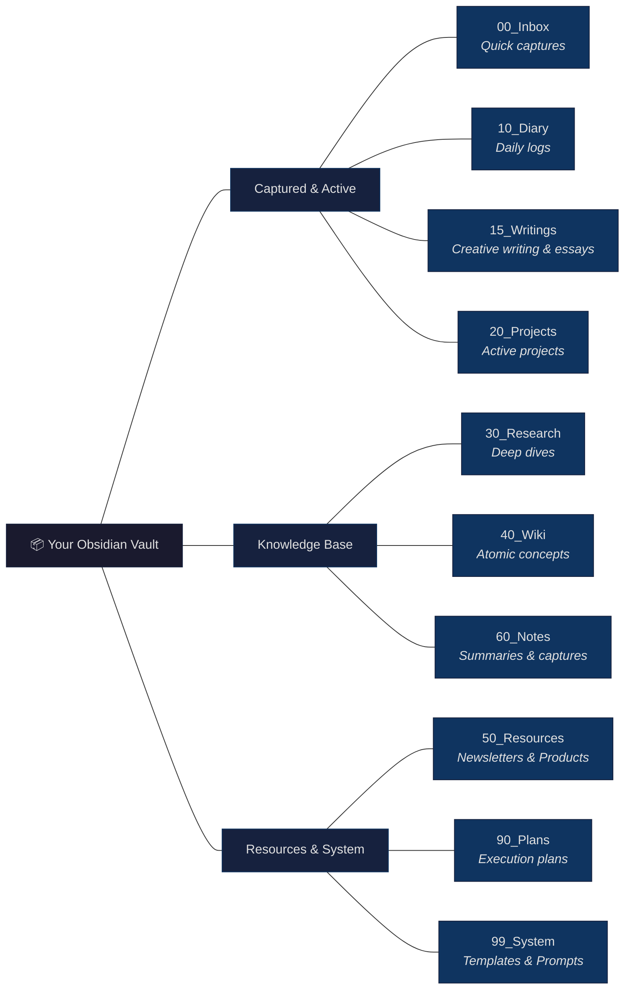
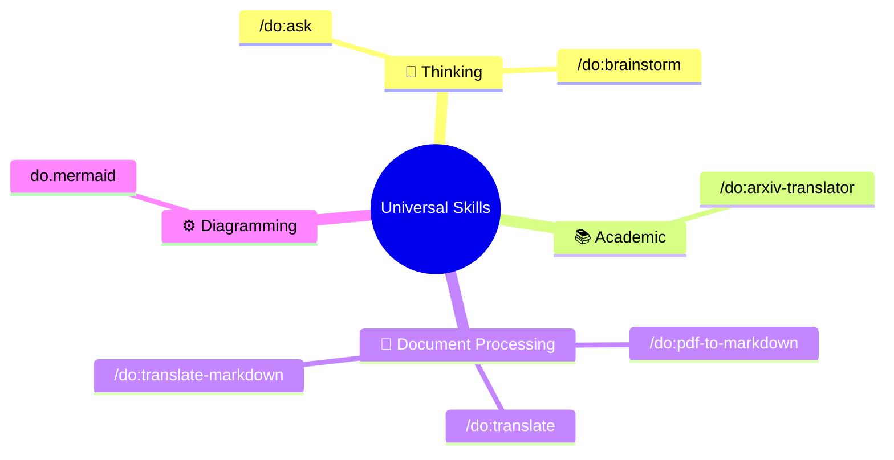
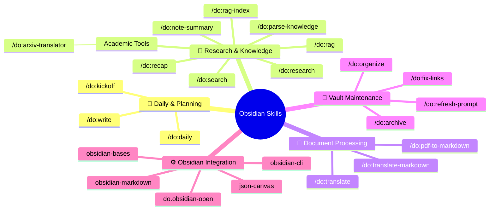
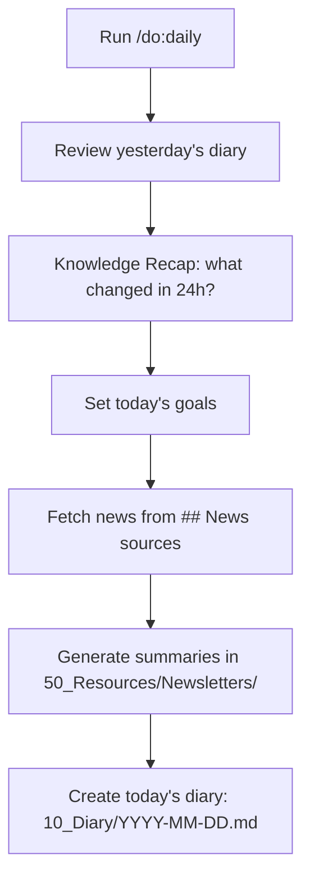
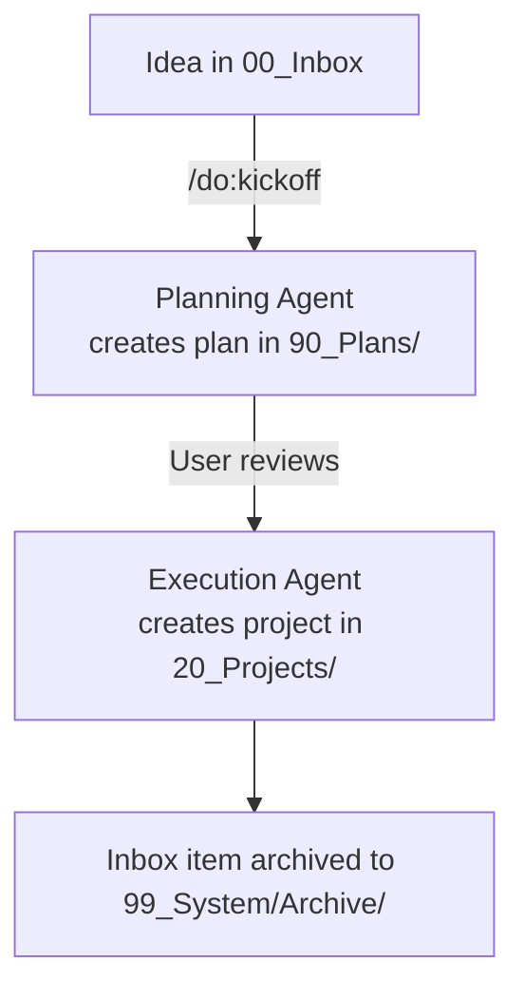
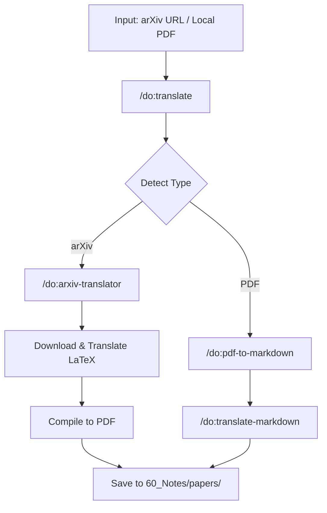
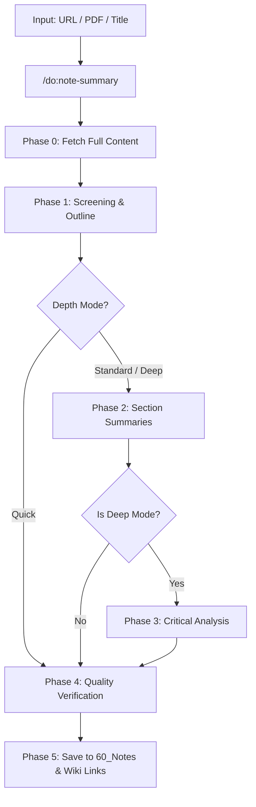

# DeepOrbit


> **An AI-agent system that bridges LLMs with Obsidian to automate deep research and personal knowledge management.**

[**中文文档**](README_CN.md)

DeepOrbit turns your [Obsidian](https://obsidian.md/) vault into an AI-powered research engine. It uses portable **Agent Skills** (compatible with Claude Code, Cursor, Codex, Gemini CLI, and any agent that supports the standard) to automate deep research, paper translation, content curation, and vault maintenance — so you can focus on thinking, not filing.

> [!IMPORTANT]
> **Obsidian is required.** DeepOrbit's folder structure, wikilink system, and templates all depend on a local Obsidian vault.

🙏 **Acknowledgments**: DeepOrbit is deeply inspired by [OrbitOS by MarsWang42](https://github.com/MarsWang42/OrbitOS). We extend our sincere gratitude for their innovative approach to vault structure and agent-driven workflows.

---

## How It Works



You give DeepOrbit raw inputs — an arXiv link, a PDF, a quick idea, a URL. The Agent Engine routes your request to the right **Skill**, which processes, translates, summarizes, or structures the content and saves it directly into your Obsidian vault with proper metadata and wikilinks.

---

## Quick Start

### Prerequisites

| Tool | Required? | Note |
|------|-----------|------|
| [Obsidian](https://obsidian.md/) | ✅ Yes | Vault management |
| An Agent Skills runtime — [Claude Code](https://docs.anthropic.com/en/docs/claude-code), Cursor, Codex, [Gemini CLI](https://github.com/google-gemini/gemini-cli), etc. | ✅ Yes | Agent runtime |
| [obsidian-skills](https://github.com/kepano/obsidian-skills) | ✅ Yes | Required for native Obsidian formats. If using Gemini CLI, ask the AI to "add https://github.com/kepano/obsidian-skills to my system skills". |
| [ralph](https://github.com/gemini-cli-extensions/ralph) | **Gemini CLI only** | Drives the section-by-section *manifest loop* in `/do:pdf-to-markdown`, `/do:translate-markdown`, `/do:research`. On Claude Code the same loop runs natively via sub-agents (Task tool) or the `/loop` command — no extra install. |
| `xelatex` | **recommended** | For `/do:arxiv-translator`.<br/>- macOS: `brew install --cask mactex-no-gui`<br/>- Windows: [MiKTeX](https://miktex.org/) or [TeX Live](https://www.tug.org/texlive/) |
| `obsidian-cli` | **recommended** | For `do.obsidian-open` to automatically open generated notes.<br/>- See: https://obsidian.md/cli |

### Setup Instructions

DeepOrbit is a standard **Agent Skills** pack. Pick whichever installer matches your agent — all three install the same skills from `skills/`.

#### Method A: `npx skills` (Recommended — works with any agent)

The universal installer. It supports Claude Code, Cursor, Codex, Windsurf, and many others, and symlinks the skills into each tool's directory automatically.

```bash
# In your project (or run with --global for user-wide install)
npx skills add dull-bird/DeepOrbit
```

#### Method B: Claude Code plugin

```text
/plugin marketplace add dull-bird/DeepOrbit
/plugin install deeporbit@deeporbit
```

This registers all 22 `do.*` skills as a Claude Code plugin. Restart or reload skills to activate.

#### Method C: Gemini CLI (compatibility)

```bash
gemini extension install dull-bird/DeepOrbit
```

The `commands/do/*.toml` slash commands keep working for Gemini CLI users.

#### Then: initialize your vault (all methods)

Inject DeepOrbit's core prompt into your Obsidian vault, then activate:

- **macOS/Linux**: `bash scripts/init_deeporbit_prompt.sh ~/path/to/your/vault`
- **Windows**: `& ".\scripts\init_deeporbit_prompt.ps1" "C:\path\to\your\vault"`

Then ask your agent in natural language ("run init", "start research") — it discovers the skills automatically. Gemini CLI users can also run `/do:init ~/path/to/your/vault` followed by `/memory refresh`.

#### Optional: native RAG tools via MCP

`do.rag` and `do.search` shell out to the scripts in `scripts/rag/` by default. If you'd rather call them as native MCP tools (`rag_query`, `rag_search`), the repo ships an optional MCP server — see [`mcp/README.md`](mcp/README.md) and the project-scoped [`.mcp.json`](.mcp.json).

### Language Configuration

Edit `deeporbit.json` in your vault root to set the AI's interaction language:

```json
{ "language": "zh-CN" }
```

> **Note:** Folder paths always stay in English for stability. Only the AI's responses and generated note content follow this setting.

---

## Vault Structure



---

## Skills Overview

DeepOrbit ships with **22 pre-configured `do.*` skills** (plus optional external [obsidian-skills](https://github.com/kepano/obsidian-skills) for native Obsidian formats), split into two categories:

### 🌐 Universal Skills (Work Anywhere)

These skills work independently — no Obsidian vault required.



### 📂 Obsidian Skills (Require Vault)

These skills read from or write to the DeepOrbit vault structure.



### Skills Quick Reference

| Command | What it does |
|---------|-------------|
| `/do:daily` | Morning planning: recap yesterday, fetch news, create today's note |
| `/do:kickoff` | Convert an inbox idea into a structured project (two-agent workflow) |
| `/do:research` | Deep dive into a topic → Research notes + Wiki entries (two-agent workflow) |
| `/do:ask` | Quick Q&A without heavy note-taking |
| `/do:brainstorm` | Interactive Socratic brainstorming partner |
| `/do:rag` | Ask questions using semantic search across your entire vault |
| `/do:rag-index` | Index the Obsidian vault for semantic RAG search |
| `/do:search` | Fast exact keyword or regex string match search across your vault |
| `/do:note-summary` | Auto-fetch URL/file/paper → structured summary + vault archiving |
| `/do:parse-knowledge` | Turn unstructured text into vault-ready Research + Wiki notes |
| `/do:arxiv-translator` | Download arXiv paper → translate LaTeX → compile PDF |
| `/do:pdf-to-markdown` | PDF → Markdown with completeness checklist + image extraction |
| `/do:translate-markdown` | Translate Markdown to target language, section-by-section with verification |
| `/do:translate` | Smartly route translation requests for arXiv or standard PDFs to appropriate skills |
| `/do:organize` | Deep vault reorganization: root hygiene, taxonomy, orphans, metadata |
| `/do:refresh-prompt` | Safely update DeepOrbitPrompt.md with diff comparison + merge options |
| `do.obsidian-open` | Utility to automatically open modified notes in Obsidian via CLI |

---

### 🤖 Multi-Agent Compatibility

DeepOrbit ships as tool-neutral **Agent Skills** (`skills/do.*/SKILL.md`), so any agent that supports the standard discovers and triggers them by description:

*   **Claude Code / Cursor / Codex / Windsurf**: Install via `npx skills add` or the Claude Code plugin. Skills trigger automatically by intent, or you invoke them in natural language ("start research", "summarize this PDF").
*   **Gemini CLI**: In addition to skills, the `commands/do/*.toml` files register native `/do:command` slash commands.

The single source of truth is `skills/`; the per-tool install directories are generated by the installer and are git-ignored.

---

---

## Core Workflow Examples

### 🌅 Morning Routine



### 💡 Idea → Project



### 📄 Academic Paper Pipeline



### 📝 Automated Summary & Archiving



---

## Philosophy

> Everything orbits around you. Keep your knowledge in motion, but let the AI agents do the heavy lifting of parsing, translating, summarizing, and maintaining the structural integrity of your ideas.
lating, summarizing, and maintaining the structural integrity of your ideas.
