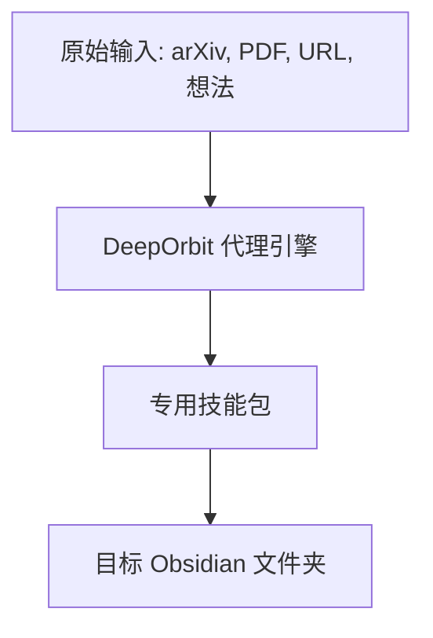
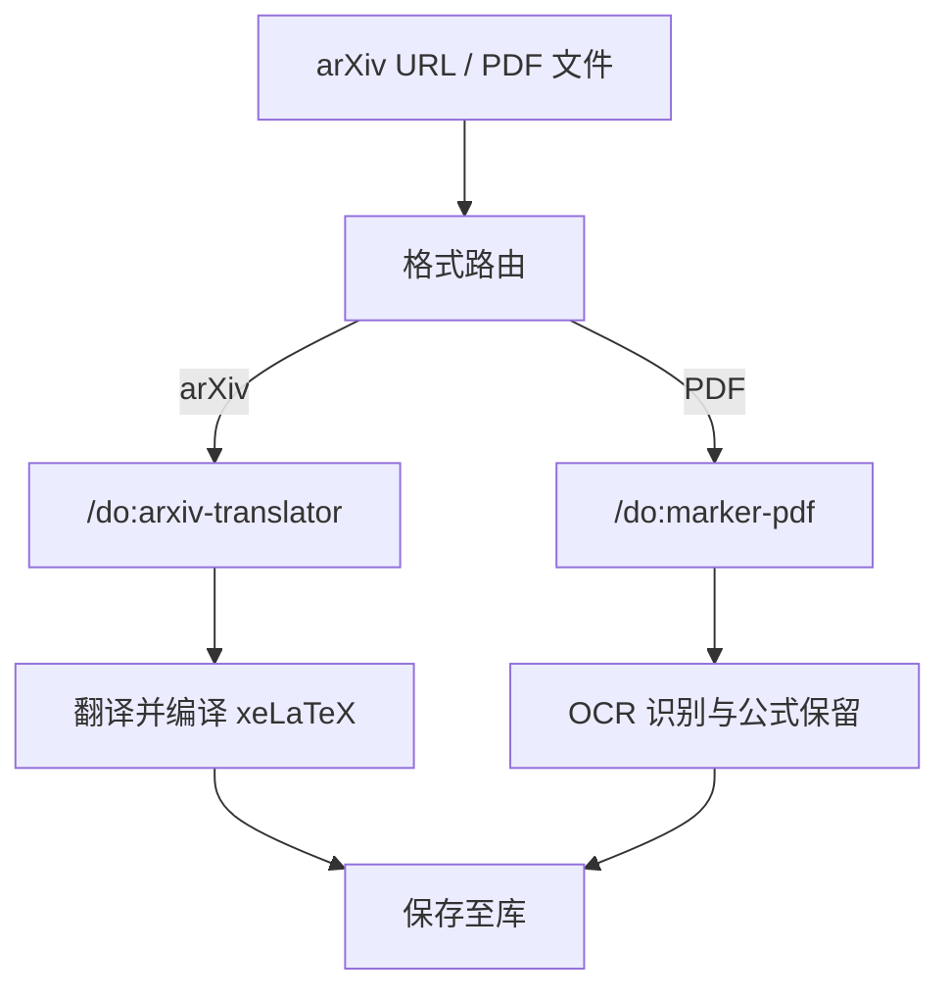
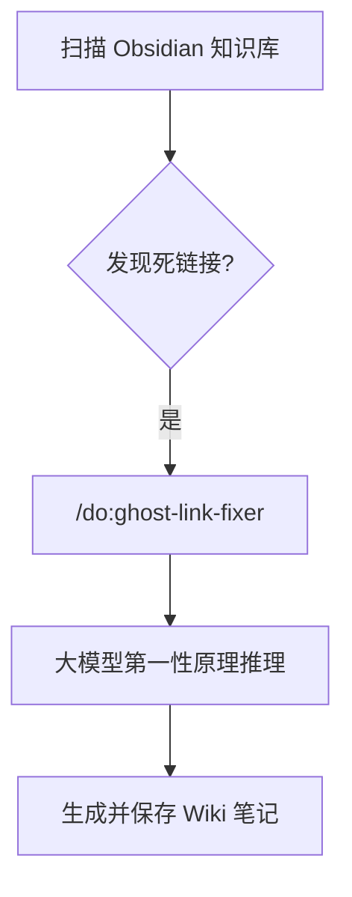

# DeepOrbit


> 不只是一款个人知识管理工具，更是一个全自动化、AI 驱动的数字研究助理。

DeepOrbit 是一个专为 **Obsidian** 设计的高定、AI 驱动的个人知识管理（PKM）和研究助理系统。

> [!IMPORTANT]
> **必须安装 Obsidian**
> 此项目完全依赖于 [Obsidian](https://obsidian.md/) 作为底层的笔记工具。系统的架构、文件夹机制以及维基链接结构都在本地 Obsidian Vault 中生效。你必须安装 Obsidian 才能让 DeepOrbit 正常运行。

🙏 **致谢**: DeepOrbit 深受 [OrbitOS by MarsWang42](https://github.com/MarsWang42/OrbitOS) 的核心理念和基础工作流启发并以此建立。在此对他们在知识库结构和 AI 驱动工作流上的创新深表感谢。

传统的 PKM 系统主要依赖人工录入和链接知识，而 **DeepOrbit** 则通过由 AI 代理（通过 Gemini CLI / Claude Code）组成的超强引擎，自动完成深度研究、文献翻译、内容策展以及结构维护。

---

## 🗺️ 架构与工作流概览

DeepOrbit 就像一个强大的引擎，它能够接收原始输入（URL、论文、PDF、文本想法），然后通过特定的 AI 技能包进行处理，最后将结构化的输出内容直接保存到你本地的 Obsidian 知识库中。

### 1. 采集与处理



- **输入**: arXiv 链接、本地/在线 PDF、网页 URL、新闻简报或是你收件箱里的原生想法。
- **代理引擎**: 一整套特定领域的代理，用来处理不同类型的输入。根据数据来源，引擎会自动进行翻译、OCR 识别、总结或结构化处理。
- **存储**: 处理后的信息会根据你在 `deeporbit.json` 中的全局语言配置，自动保存到 Obsidian 知识库的指定文件夹（例如 `projects_folder`, `notes_folder`, `resources_folder`）。

### 2. 学术与研究工作流



- **arXiv 与 PDF 翻译**: 像 `arxiv-translator` 这种工具能够下载 LaTeX 源码，将其翻译成目标语言（如中文/英文）并编译出格式完整的 PDF。`marker-pdf` 则能在保留复杂数学公式的前提下，把高保真的 PDF 转换成结构化 Markdown。

### 3. 知识维护循环



- **幽灵链接修复器 (Ghost Link Fixer)**: 扫描你的知识库中未创建的死链接（空维基链接），自动请求大语言模型撰写出高质量的基石笔记，填补知识空白。
- **内容自动化流水线**: 定时调度任务负责抓取新闻、去重、排序，并最后总结为精选的每日摘要。

---

## 🚀 核心功能与 AI 技能包

DeepOrbit 在 `skills/` 目录下提供了多达 20 种以上的预配置 AI 代理技能。

### 🧠 学术与研究包
- **`/do:arxiv-translator`**: 获取 arXiv LaTeX 源码，在保留数学公式的情况下翻译论文，并使用 `xelatex` 编译成 PDF。
- **`/do:marker-pdf`**: 高保真 PDF 转 Markdown（由 `marker` 驱动），专门为复杂数学公式进行优化。
- **`/do:translate-pdf`**: 翻译 PDF 文档，同时保留原有的排版、结构、颜色和样式。
- **`/do:notebooklm`**: 通过浏览器自动化查询 Google NotebookLM，获取没有幻觉的精准答案。

### 🕸️ 知识维护与策展
- **`/do:note-summary`**: 从 URL 或本地文件中获取全文，并在你的笔记中生成总结。
- **`/do:ghost-link-fixer`**: 扫描知识库的空维基链接，自动生成基于第一性原理的 Wiki 笔记。
- **`/do:ai-research-digest` / `/do:ai-newsletters` / `/do:ai-products`**: 全自动工作流，每天抓取、总结并去重最新的 AI 新闻和产品。
- **`/do:archive`**: 安全归档已完成的任务或陈旧的收件箱项，保持系统清爽。
- **`/do:organize` / `/do:recap`**: 总结近期知识库的活动，并按照逻辑组织笔记。

### ⚙️ 核心工作流（项目管理）
- **`/do:kickoff`**: 瞬间将收件箱的一个想法转换成结构化的、激活的项目文件夹。
- **`/do:daily`**: 引导式的早晨计划工作流，回顾日记、抓取新闻并规划任务。
- **`/do:research`**: 采用双代理架构，深度研究任何主题并输出结构化的 Wiki 词条。
- **`/do:parse-knowledge`**: 将非结构化的长文本整合进知识库的框架中。
- **`/do:brainstorm` / `/do:ask`**: 从你的 AI 助手这里获取想法，或是不用费力记笔记就获得答案。

### 🔧 Obsidian 技术集成
- **`do.obsidian-markdown` / `do.obsidian-bases` / `do.json-canvas`**: 专门用于与 Obsidian 原生特性（如白板 Canvas、特定 Markdown 格式、数据结构）交互的工具集。

---

## 🛠️ 安装与设置

1. **环境依赖**: 
   - [Obsidian](https://obsidian.md/) (这是管理知识库的核心依赖)。
   - Gemini CLI 或 Claude Code。
   - 部分特定技能需要安装本地工具（例如：`arxiv-translator` 需要 `xelatex`，`notebooklm` 需要 `playwright`，`marker-pdf` 需要 `marker`）。
2. **克隆代码库**:
   ```bash
   git clone https://github.com/dull-bird/DeepOrbit.git
   ```
3. **全局配置**:
   - 在项目根目录下找到 `deeporbit.json`。该文件控制着你的核心偏好：
     - `language`：设定 AI 的默认交互语言（如：`zh-CN`, `en`）。
     - `folder_mapping`：定义 Obsidian 对应的文件夹名（入件箱、日记、项目、维基等）。所有的 AI 技能都会动态读取这些位置。如果你需要中英切换，可以运行 `/do:switch-language zh-cn` 或者 `/do:switch-language en`。
4. **初始化提示词与库**:
   在你的 Obsidian 知识库 (或者任何你想用的文件夹) 中，使用 `scripts/` 里的脚本来运行初始化。
   - Windows环境: 运行 `scripts\init_deeporbit_prompt.ps1`
   - Linux/macOS环境: 运行 `scripts/init_deeporbit_prompt.sh`
   该脚本会读取 `deeporbit.json`，把 `DeepOrbitPrompt.md` 复制过去，根据映射自动把所有需要的 Obsidian 文件夹建好，并且将路径注入到 `.gemini/settings.json`。

5. **加载技能**:
   在你的 CLI 配置文件（如 `AGENTS.md`）中，只需把位置指向克隆目录中的 `skills` 文件夹。随后即可使用 `/do:<命令名称>` 来执行了。

---

## 🌌 核心哲学

一切都围绕着你运转。让你的想法保持生命力并持续流动，把那些枯燥的解析、翻译、总结以及维持结构一致性的重活儿，统统丢给 AI 代理吧。
