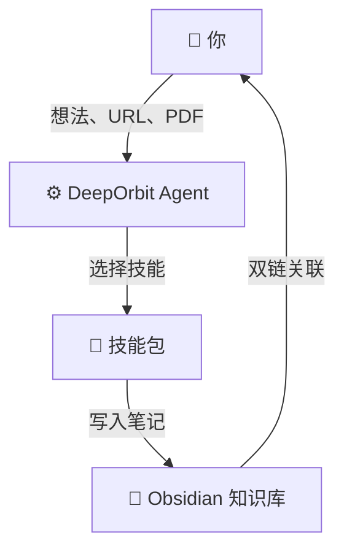
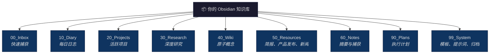
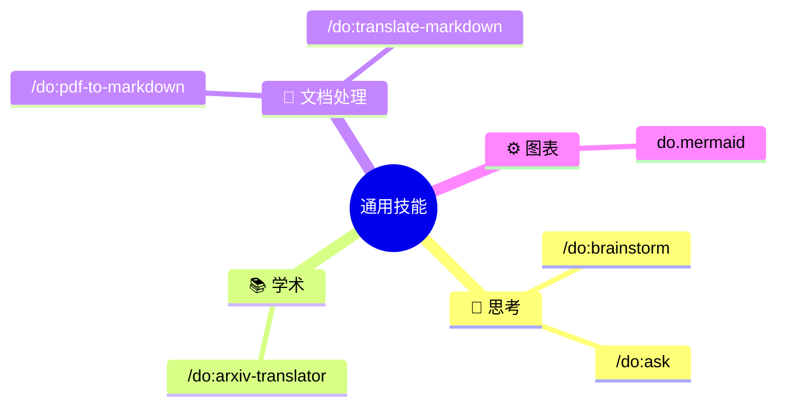
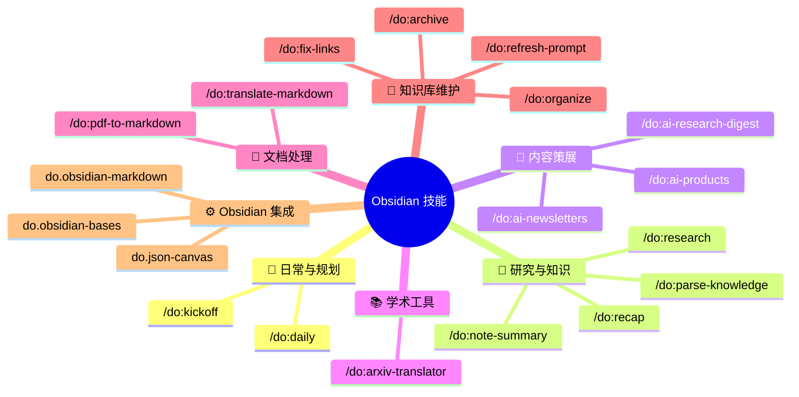
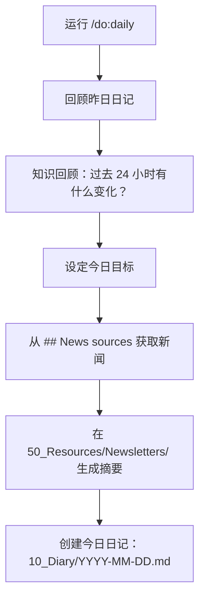
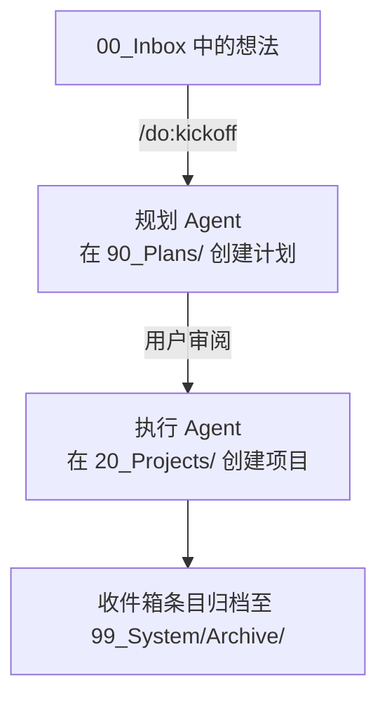
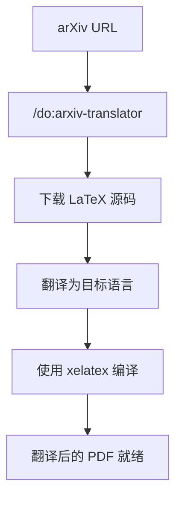
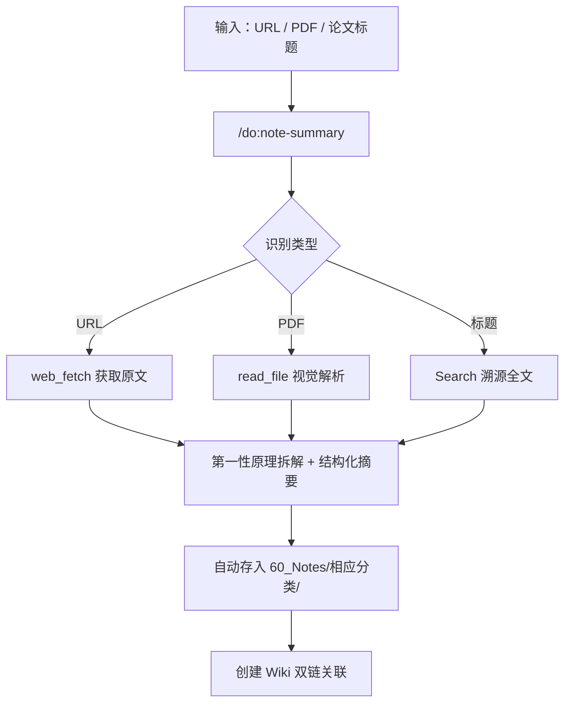

# DeepOrbit


> **一个连接大语言模型与 Obsidian 的 AI Agent 系统，自动化深度研究与个人知识管理。**

[**English**](README.md)

DeepOrbit 将你的 [Obsidian](https://obsidian.md/) 知识库变成 AI 驱动的研究引擎。它通过专用的 Agent 技能（基于 Gemini CLI / Claude Code）自动完成深度研究、论文翻译、内容策展和知识库维护 —— 让你专注于思考，而非整理。

> [!IMPORTANT]
> **需要安装 Obsidian。** DeepOrbit 的文件夹结构、双链系统和模板都依赖本地 Obsidian 知识库。

🙏 **致谢**：DeepOrbit 深受 [OrbitOS (MarsWang42)](https://github.com/MarsWang42/OrbitOS) 启发。感谢其在知识库架构和 Agent 驱动工作流方面的创新理念。

---

## 工作原理



你向 DeepOrbit 提供原始输入 —— 一个 arXiv 链接、一个 PDF、一个灵感、一个 URL。Agent 引擎会将请求路由到合适的**技能**，该技能负责处理、翻译、摘要或结构化内容，并将结果直接保存到你的 Obsidian 知识库中，附带完整的元数据和双链。

---

## 快速开始

### 前置要求

| 工具 | 必需？ | 说明 |
|------|--------|------|
| [Obsidian](https://obsidian.md/) | ✅ 是 | 知识库管理 |
| [Gemini CLI](https://github.com/google-gemini/gemini-cli) 或 [Claude Code (有限支持)](https://docs.anthropic.com/en/docs/claude-code) | ✅ 是 | Agent 运行时 |
| `ralph` | **必需** | 用于 `/do:pdf-to-markdown` 和 `/do:translate-markdown` |
| `xelatex` | 可选 | 用于 `/do:arxiv-translator` |

### 三步安装

```bash
# 1. 克隆仓库
git clone https://github.com/dull-bird/DeepOrbit.git

# 2. 在你的 Obsidian 知识库中运行初始化
# Windows (PowerShell):
& "$env:USERPROFILE\.gemini\extensions\deeporbit\scripts\init_deeporbit_prompt.ps1" "C:\你的\知识库\路径"

# macOS/Linux (Bash):
bash ~/.gemini/extensions/deeporbit/scripts/init_deeporbit_prompt.sh ~/你的/知识库/路径

# 3. 在 Gemini CLI 中初始化
/do:init ~/你的/知识库/路径
/memory refresh
```

初始化脚本（或 `/do:init` 命令）会自动：
- 将 `DeepOrbitPrompt.md` 和 `deeporbit.json` 复制到你的知识库
- 创建所有知识库文件夹（见下方结构）
- 将 `DeepOrbitPrompt.md` 注入 `.gemini/settings.json`

### 语言配置

编辑知识库根目录下的 `deeporbit.json` 设置 AI 的交互语言：

```json
{ "language": "zh-CN" }
```

> **注意：** 文件夹路径始终保持英文以确保稳定性。只有 AI 的回复和生成的笔记内容会遵循此语言设置。

---

## 知识库结构



---

## 技能一览

DeepOrbit 内置 **24 个预配置 AI 技能**，分为两大类：

### 🌐 通用技能(无需 Obsidian)

这些技能独立运作, 不依赖 Obsidian 知识库。



### 📂 Obsidian 技能(需要知识库)

这些技能依赖 DeepOrbit 知识库的文件夹结构。



### 技能速查表

| 命令 | 功能 |
|------|------|
| `/do:daily` | 晨间规划：回顾昨日、获取新闻、创建今日笔记 |
| `/do:kickoff` | 将收件箱中的想法转化为结构化项目（双 Agent 工作流） |
| `/do:research` | 深入研究某个主题 → 生成研究笔记 + Wiki 条目（双 Agent 工作流） |
| `/do:ask` | 快速问答，无需繁重的笔记流程 |
| `/do:brainstorm` | 交互式苏格拉底式头脑风暴伙伴 |
| `/do:note-summary` | 自动抓取 URL/文件/论文 → 结构化摘要 + 知识库双链归档 |
| `/do:parse-knowledge` | 将非结构化文本转化为知识库就绪的研究笔记 + Wiki 条目 |
| `/do:recap` | 指定时间范围的知识库活动周期性回顾报告 |
| `/do:arxiv-translator` | 下载 arXiv 论文 → 翻译 LaTeX → 编译 PDF |
| `/do:pdf-to-markdown` | PDF → Markdown, 完整性清单 + 图像提取 |
| `/do:translate-markdown` | 逐 section 翻译 Markdown, 术语一致性校验 |
| `/do:ai-newsletters` | 每日 AI 新闻简报摘要（基于 RSS） |
| `/do:ai-products` | AI 产品发布摘要（Product Hunt、HN、GitHub、Techmeme） |
| `/do:ai-research-digest` | AI 研究摘要（来自机器之心） |
| `/do:fix-links` | 扫描知识库中的失效双链 → 自动生成 Wiki 笔记 |
| `/do:archive` | 归档已完成的项目和已处理的收件箱条目 |
| `/do:organize` | 深度知识库重组: 根目录清理 + 分类修复 + 孤立笔记 + 元数据 |
| `/do:refresh-prompt` | 安全更新 DeepOrbitPrompt.md, diff 对比 + 合并选项 |

---

## 核心工作流示例

### 🌅 晨间流程



### 💡 想法 → 项目



### 📄 学术论文处理流程



### 📝 自动化摘要与归档



---

## 理念

> 一切围绕你运转。让知识保持流动，让 AI Agent 承担解析、翻译、摘要和维护知识结构完整性的重任。
