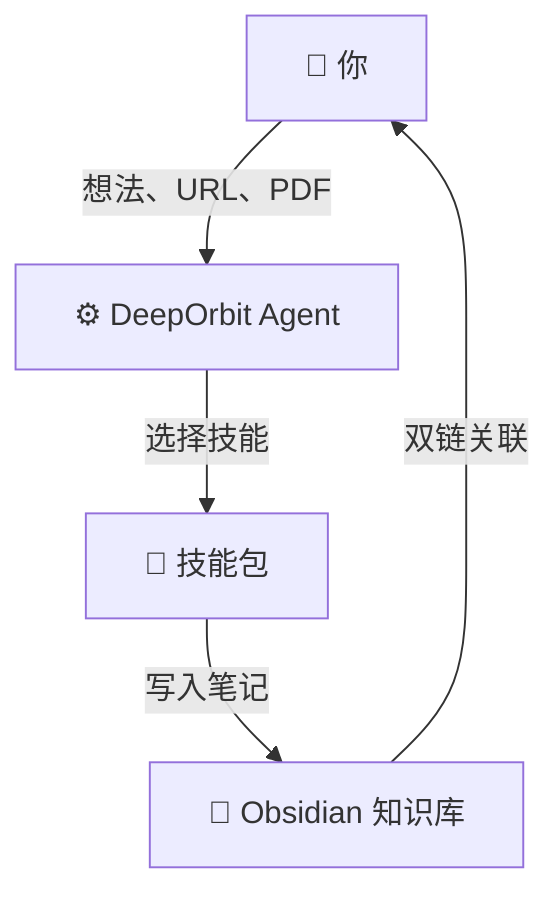
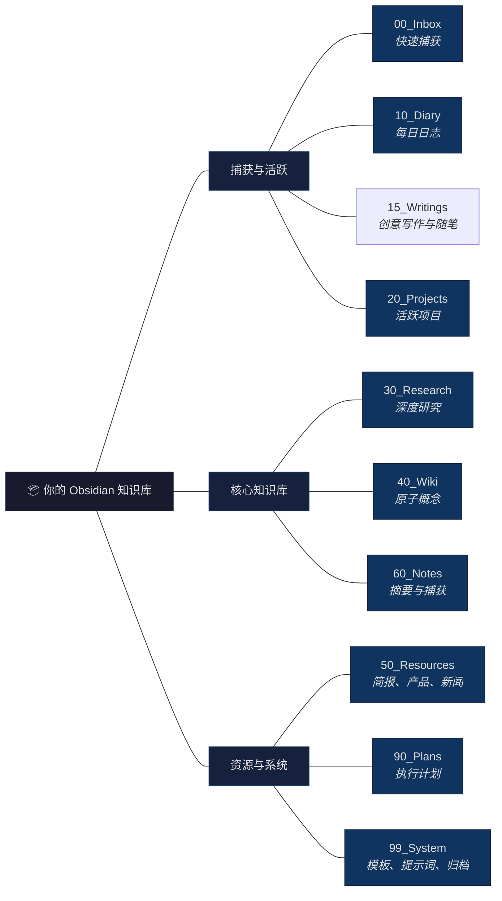
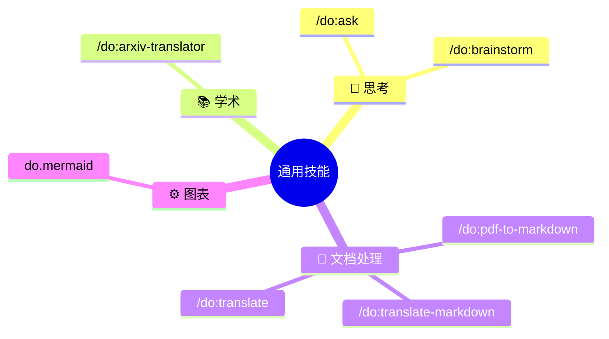
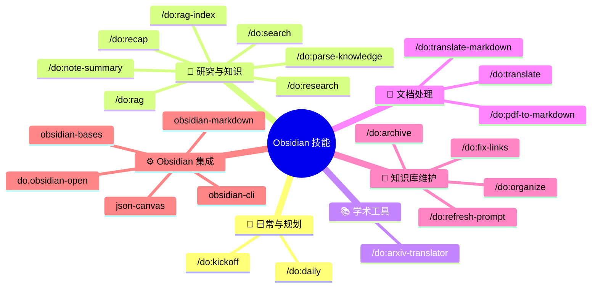
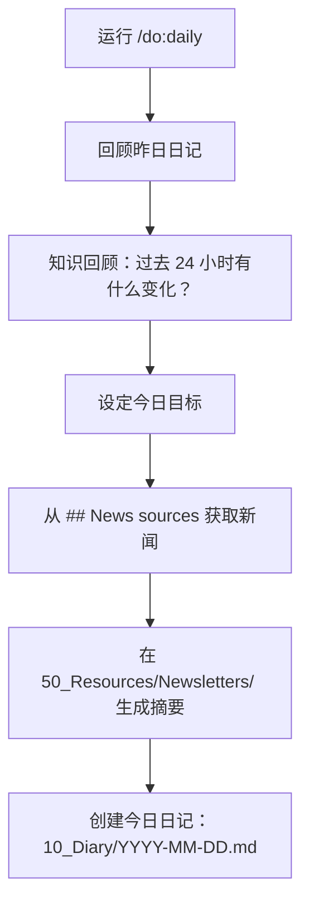
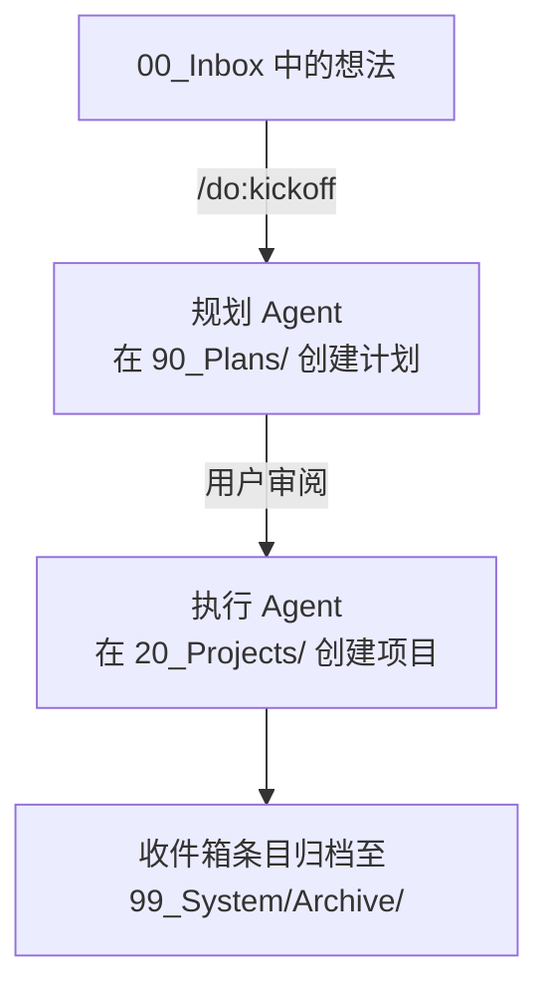
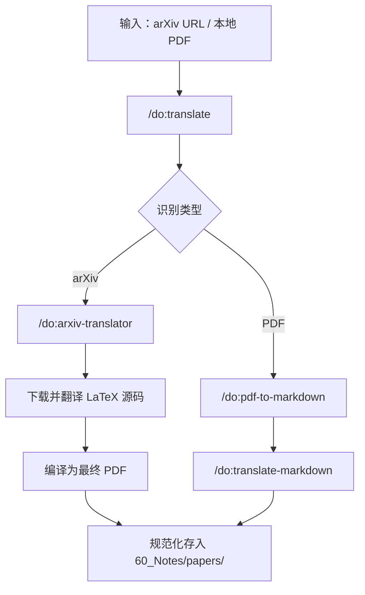

# DeepOrbit


> **一个连接大语言模型与 Obsidian 的 AI Agent 系统，自动化深度研究与个人知识管理。**

[**English**](README.md)

DeepOrbit 将你的 [Obsidian](https://obsidian.md/) 知识库变成 AI 驱动的研究引擎。它通过可移植的 **Agent Skills**（兼容 Claude Code、Cursor、Codex、Gemini CLI 等任意支持该标准的 Agent）自动完成深度研究、论文翻译、内容策展和知识库维护 —— 让你专注于思考，而非整理。

> [!IMPORTANT]
> **需要安装 Obsidian。** DeepOrbit 的文件夹结构、双链系统和模板都依赖本地 Obsidian 知识库。

🙏 **致谢**：DeepOrbit 深受 [OrbitOS (MarsWang42)](https://github.com/MarsWang42/OrbitOS) 启发。感谢其在知识库架构和 Agent 驱动工作流方面的创新理念。

---

## 工作原理



你向 DeepOrbit 提供原始输入 —— 一个 arXiv 链接、一个 PDF、一个灵感、一个 URL。Agent 引擎会将请求路由到合适的**技能**，该技能负责处理、翻译、摘要或结构化内容，并将结果直接保存到你的 Obsidian 知识库中，附带完整的元数据和双链。

---

## 快速开始

### 前置要求

| 工具 | 必需？ | 说明 |
|------|--------|------|
| [Obsidian](https://obsidian.md/) | ✅ 是 | 知识库管理 |
| 任一 Agent Skills 运行时 —— [Claude Code](https://docs.anthropic.com/en/docs/claude-code)、Cursor、Codex、[Gemini CLI](https://github.com/google-gemini/gemini-cli) 等 | ✅ 是 | Agent 运行时 |
| [obsidian-skills](https://github.com/kepano/obsidian-skills) | ✅ 是 | 处理 Obsidian 原生格式必需。如果你使用 Gemini CLI，可以直接告诉 AI：“请帮我把 https://github.com/kepano/obsidian-skills 加入到系统的 skills 里面去”。 |
| [ralph](https://github.com/gemini-cli-extensions/ralph) | **仅 Gemini CLI** | 为 `/do:pdf-to-markdown`、`/do:translate-markdown`、`/do:research` 驱动分节的 *manifest 循环*。在 Claude Code 上同样的循环用子代理（Task 工具）或 `/loop` 命令原生运行，无需额外安装。 |
| `xelatex` | **推荐** | 用于 `/do:arxiv-translator`。<br/>- macOS: `brew install --cask mactex-no-gui`<br/>- Windows: [MiKTeX](https://miktex.org/) 或 [TeX Live](https://www.tug.org/texlive/) |
| `obsidian-cli` | **推荐** | 用于 `do.obsidian-open` 自动在 Obsidian 打开笔记。<br/>- 参考 https://obsidian.md/cli |

### 安装说明

DeepOrbit 是标准的 **Agent Skills** 技能包。任选一种与你的 Agent 匹配的安装方式 —— 三种方式安装的都是 `skills/` 里同一套技能。

#### 方法 A：`npx skills`（推荐 —— 通用，适配任意 Agent）

通用安装器，支持 Claude Code、Cursor、Codex、Windsurf 等，会自动把技能软链接到各工具的目录里。

```bash
# 在你的项目目录下执行（加 --global 可做用户级全局安装）
npx skills add dull-bird/DeepOrbit
```

#### 方法 B：Claude Code 插件

```text
/plugin marketplace add dull-bird/DeepOrbit
/plugin install deeporbit@deeporbit
```

这会把全部 22 个 `do.*` 技能注册为 Claude Code 插件。安装后重启或重新加载技能即可生效。

#### 方法 C：Gemini CLI（兼容）

```bash
gemini extension install dull-bird/DeepOrbit
```

`commands/do/*.toml` 里的斜杠命令对 Gemini CLI 用户继续可用。

#### 然后：初始化知识库（所有方式通用）

将 DeepOrbit 的核心提示词注入你的 Obsidian 知识库，再激活：

- **macOS/Linux**：`bash scripts/init_deeporbit_prompt.sh ~/你的/知识库/路径`
- **Windows**：`& ".\scripts\init_deeporbit_prompt.ps1" "C:\你的\知识库\路径"`

之后用自然语言对 Agent 下令（如「执行 init」「开始 research」），它会自动发现并触发技能。Gemini CLI 用户也可运行 `/do:init ~/你的/知识库/路径` 后执行 `/memory refresh`。

#### 可选：通过 MCP 暴露原生 RAG 工具

`do.rag` 和 `do.search` 默认调用 `scripts/rag/` 下的脚本。如果你想把它们作为原生 MCP 工具（`rag_query`、`rag_search`）调用，仓库附带一个可选的 MCP server —— 见 [`mcp/README.md`](mcp/README.md) 和项目级的 [`.mcp.json`](.mcp.json)。

### 语言配置

编辑知识库根目录下的 `deeporbit.json` 设置 AI 的交互语言：

```json
{ "language": "zh-CN" }
```

> **注意：** 文件夹路径始终保持英文以确保稳定性。只有 AI 的回复和生成的笔记内容会遵循此语言设置。

---

## 知识库结构



---

## 技能一览

DeepOrbit 内置 **22 个预配置 `do.*` 技能**（另可选装外部 [obsidian-skills](https://github.com/kepano/obsidian-skills) 以支持 Obsidian 原生格式），分为两大类：

### 🌐 通用技能(无需 Obsidian)

这些技能独立运作, 不依赖 Obsidian 知识库。



### 📂 Obsidian 技能(需要知识库)

这些技能依赖 DeepOrbit 知识库的文件夹结构。



### 技能速查表

| 命令 | 功能 |
|------|------|
| `/do:daily` | 晨间规划：回顾昨日、获取新闻、创建今日笔记 |
| `/do:kickoff` | 将收件箱中的想法转化为结构化项目（双 Agent 工作流） |
| `/do:write` | 自由书写空间，在 15_Writings 中润色想法并获取 AI 建议 |
| `/do:research` | 深入研究某个主题 → 生成研究笔记 + Wiki 条目（双 Agent 工作流） |
| `/do:ask` | 快速问答，无需繁重的笔记流程 |
| `/do:brainstorm` | 交互式苏格拉底式头脑风暴伙伴 |
| `/do:rag` | 跨整个知识库进行 RAG 语义检索问答 |
| `/do:rag-index` | 使用 ChromaDB 为知识库构建本地语义索引 |
| `/do:search` | 通过关键字或正则在整个知识库中进行精确的全文检索 |
| `/do:note-summary` | 自动抓取 URL/文件/论文 → 结构化摘要 + 知识库双链归档 |
| `/do:parse-knowledge` | 将非结构化文本转化为知识库就绪的研究笔记 + Wiki 条目 |
| `/do:arxiv-translator` | 下载 arXiv 论文 → 翻译 LaTeX → 编译 PDF |
| `/do:pdf-to-markdown` | PDF → Markdown, 完整性清单 + 图像提取 |
| `/do:translate-markdown` | 逐 section 翻译 Markdown, 术语一致性校验 |
| `/do:translate` | 智能路由 arXiv 或标准 PDF 的翻译请求至合适的子技能 |
| `/do:organize` | 深度知识库重组: 根目录清理 + 分类修复 + 孤立笔记 + 元数据 |
| `/do:refresh-prompt` | 安全更新 DeepOrbitPrompt.md, diff 对比 + 合并选项 |
| `do.obsidian-open` | 实用工具：通过官方 CLI 自动在 Obsidian 中打开修改过的笔记 |

---

### 🤖 多 AI Agent 兼容说明

DeepOrbit 以工具无关的 **Agent Skills**（`skills/do.*/SKILL.md`）形式分发，任何支持该标准的 Agent 都能按描述自动发现并触发它们：

*   **Claude Code / Cursor / Codex / Windsurf**：通过 `npx skills add` 或 Claude Code 插件安装。技能会按意图自动触发，你也可以用自然语言调用（如「开始 research」「总结这个 PDF」）。
*   **Gemini CLI**：除技能外，`commands/do/*.toml` 还会注册原生的 `/do:command` 斜杠命令。

唯一的事实来源是 `skills/`；各工具的安装目录由安装器自动生成，已被 git 忽略。

---

---

## 核心工作流示例

### 🌅 晨间流程



### 💡 想法 → 项目



### 📄 学术论文处理流程



### 📝 自动化摘要与归档

```mermaid
flowchart TD
    A["输入：URL / PDF / 标题"] --> B["/do:note-summary"]
    B --> C["阶段 0：获取完整内容全文"]
    C --> D["阶段 1：海选大纲与分类"]
    D --> E{选择深度?}
    E -->|Quick (速读)| I["阶段 4：执行输出质量核对清单"]
    E -->|Standard / Deep| F["阶段 2：逐章节结构化总结"]
    F --> G{是 Deep 深度?}
    G -->|是| H["阶段 3：精读与批判性分析"]
    G -->|否| I
    H --> I
    I --> J["阶段 5：存入 60_Notes 并建立双链"]
```

---

## 理念

> 一切围绕你运转。让知识保持流动，让 AI Agent 承担解析、翻译、摘要和维护知识结构完整性的重任。
