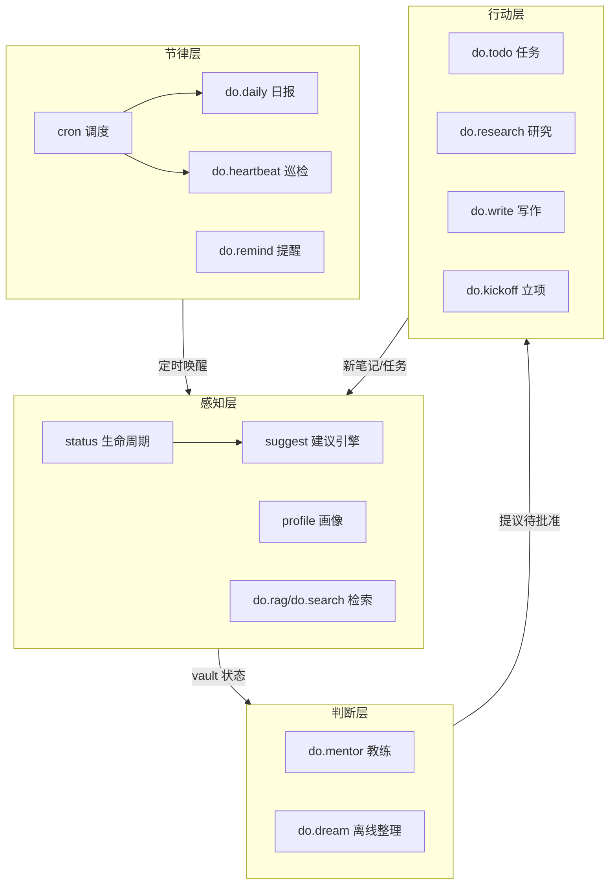

# DeepOrbit 主动参谋系统（2026-07 设计）

调研基础：OpenClaw Heartbeat/proactive-messages 模式、Khoj automations、GTD stalled
实践、批处理通知实验（Fitz & Kushlev 2019；Ohly 2023）、主动性反噬研究
（arXiv 2509.09309、2502.18658、Amershi G4）、Graph-of-Skills（arXiv 2604.05333）、
流程表示对 LLM 友好度实证（arXiv 2507.11356，Mermaid 总分最高且 token 最省）、
IFTTT/TAP 的 event/state 混淆研究、本地编排表面盘点（suggest 10 规则/recipes/cron/
sweep/profile/mentor/dream/daily）。来源见文末。

## 一句话

DeepOrbit 从"工具集"（拉模型：agent 来了才诊断）升级为"参谋"（推拉结合：
定时唤醒 → 确定性扫描 → agent 判断 → 提议待批准 → 批量送达，默认沉默）。

## 四层架构与技能关系图

技能图的规范源是 `99_System/DeepOrbit/skills_graph.yaml`（邻接表：层/输入/输出/
触发），`scripts/render_skill_graph.py` 生成 mermaid 注入 `DeepOrbitPrompt.md`——
Mermaid 是对 LLM 最友好且 token 最省的流程表示（arXiv 2507.11356 实证）；
放在每次必注入的 prompt 里（Graph-of-Skills：全量注入劣化，紧凑路由层常驻），
`validate_repo.py` 校验两者一致。图按四层分区：



## 核心机制

### 1. do.heartbeat 巡检（主动性的载体）

OpenClaw Heartbeat 模式：**定时唤醒 agent 执行检查清单，默认沉默，有事才说**。

- 调度：复用现有 cron（`cron add heartbeat ... --every daily`），不新建调度器；
  cron = 精确时间做确定的事，heartbeat = 周期检查"有没有该说的事"，职责分离。
- 确定性部分（CLI）：`deeporbit heartbeat` 输出上下文包——suggest 建议、
  status 概览、今日到期提醒、与昨日快照的 delta、WHEN 规则预筛结果。
- 判断部分（skill）：do.heartbeat 契约——读上下文包，按 `99_System/Rules/*.md`
  的状态谓词（WHEN-THEN）评估，**默认沉默**（HEARTBEAT_OK 不发送），命中才输出
  批量简报；所有行动建议走 propose-approve（与 do.dream 哲学一致）。
- 频率控制三件套（反"主动性反噬"，有研究支撑）：批处理投递（早晚各一次，nudge
  并入批次，实时只留硬截止与显式 remind）、同事项去重、安静时段由用户配置。

### 2. WHEN 规则（联动形式化）

事件驱动研究的教训：用户和 LLM 都容易混淆 event 与 state——规则写成**状态谓词**
更稳健。`99_System/Rules/*.md` 一个文件一条规则：

```markdown
---
name: stalled-project-nudge
when: active 项目 7 天无新活动，或无未完成 todo
then: 在简报中建议为该项目设下一步行动（do.todo），并询问是否暂停
---
```

CLI 做廉价预筛（能确定性判的：天数、计数、存在性），agent 做语义判断。
首批内置 3 条：项目停滞、inbox 积压（已有 suggest 规则的引用，不重复造）、
日记断更。

### 3. suggest 增加"下一步行动"语义（P0 缺口）

新确定性规则 `stalled-project`：active 且 7 天无活动，**或** active 但没有任何
未完成 todo（用新 tasks 解析器查该项目笔记的 checkbox）→ 建议"设下一步行动"，
action 指向 do.todo。检测确定性；具体的下一步内容由 agent 在 heartbeat/mentor
中从项目笔记推导（propose-approve，一键接受写入 do.todo）。

### 4. 进度快照（P0 缺口）

`deeporbit status --snapshot` 把当前概览追加为
`99_System/snapshots/YYYY-MM-DD.json`（active/paused 计数、每项目 updated、
todo 完成数）——幂等（同日覆盖）。do.daily 与 heartbeat 用"与昨日 delta"替代
静态快照，进度跟踪由此获得时间维度。

### 5. recipe 自动调度（P1 缺口）

`deeporbit recipe schedule <name>` 读 frontmatter `schedule: daily|weekly`，
幂等注册 cron job（已存在则跳过）。内置 Weekly Review / Daily News 立刻受益。

### 6. 反馈环（最小版，P2）

`suggest` 输出带稳定规则 id；`deeporbit suggest feedback <rule-id> accepted|dismissed`
记录到设备本地 `suggest_feedback.json`，heartbeat 上下文包附带各规则接受率，
供 agent 判断时降权低接受率规则（判断在 agent，计数在 CLI——不做自动隐藏，
避免黑箱）。

## 交互原则（有研究背书）

- **默认沉默**：没事不播报（HEARTBEAT_OK 抑制）。
- **批处理优于实时**：每日早晚各一批；实时仅硬截止与显式 remind。
- **propose-approve**：参谋提议，用户批准；永不在 heartbeat 里直接改 vault。
- **可关闭**：每条规则、每类简报都可 disable（主动性反噬研究的公认原则）。

## 落地清单（本轮实现）

| # | 内容 | 载体 |
|---|---|---|
| 1 | 技能关系图 YAML + mermaid 生成器 + prompt 注入 + 校验 | skills_graph.yaml, render_skill_graph.py, DeepOrbitPrompt.md |
| 2 | suggest stalled-project 规则 | suggest.py + 测试 |
| 3 | status --snapshot | work.py/cli.py + 测试 |
| 4 | heartbeat CLI 上下文包 + do.heartbeat skill + 3 条内置规则 | cli.py/heartbeat.py, skills/do.heartbeat, 99_System/Rules/ |
| 5 | recipe schedule | recipes.py/cli.py + 测试 |
| 6 | suggest feedback 记录 | suggest.py/cli.py + 测试 |
| 7 | 文档：do.mentor/do.daily 指针、README 双语（33 skills）、docs 更新 | 各处 |

显式不做（本轮）：自动研究触发器（等 heartbeat 跑起来后从规则积累）、
nudge 自动降频黑箱、移动推送。

## 调研来源（节选）

- OpenClaw Heartbeat：sfailabs.com/guides/openclaw-heartbeat-scheduling；
  heartbeat vs cron 职责：clawnify.com/resources/heartbeat-vs-cron-openclaw-guide-2026
- 批处理：Fitz & Kushlev 2019（kushlev.com/s/2019-Fitz-Batching.pdf）
- 主动性反噬：arXiv 2509.09309、2502.18658；Amershi 2019 G4
- Graph-of-Skills：arXiv 2604.05333；Mermaid 实证：arXiv 2507.11356
- TAP event/state 混淆：arXiv 1709.02788
