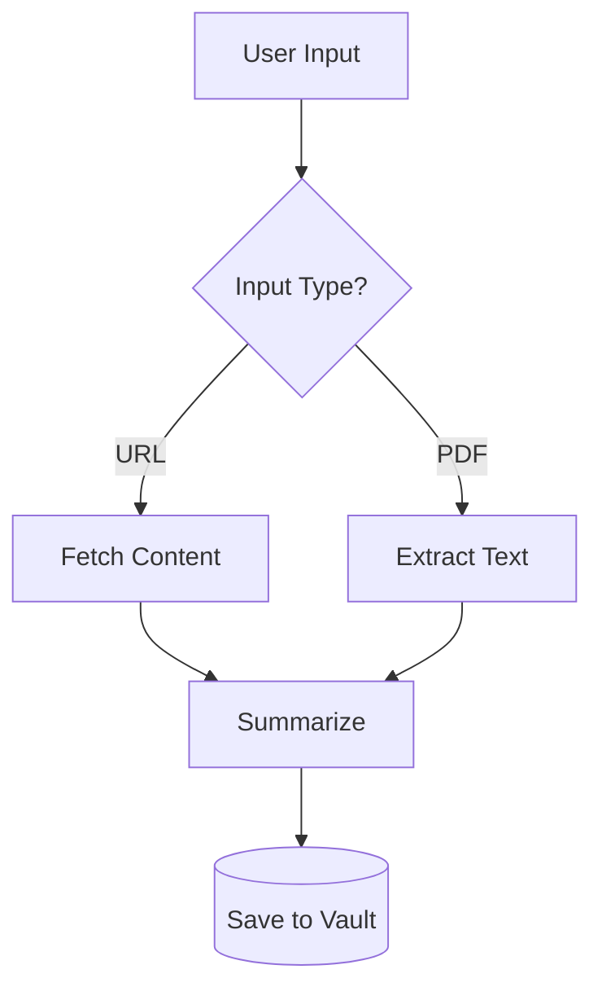

# Mermaid Diagram Skill

This skill enables accurate creation of Mermaid diagrams inside Obsidian Markdown files. The rules and selection guide below always apply; load [`reference/diagram-types.md`](reference/diagram-types.md) for the exact syntax and a worked example of any specific diagram type.

## ⚠️ Global Syntax Rules (MUST FOLLOW)

1. **NO full-width punctuation** inside code blocks. All parentheses, commas, colons, and symbols MUST be half-width (English) characters.
   - ❌ `，` `。` `！` `（` `）` `：`
   - ✅ `,` `.` `!` `(` `)` `:`
2. **Quote node labels** containing special characters like `()`, `[]`, `{}` using double quotes: `A["Label (info)"]`
3. **No HTML tags** in labels (use ` ` only when explicitly needed for line breaks).
4. **Indentation matters** in mindmaps and timelines — use spaces only, never `- ` or `* `.
5. **Flowcharts default to `flowchart TD`** (top-down) unless the user asks otherwise.
6. Read `deeporbit.json` from the workspace root to determine the interaction language. Use this language for all your responses and generated note contents (e.g. `zh-CN`). **The Obsidian folder paths themselves will ALWAYS remain in English.**
- Set `author: ai` in frontmatter for every note you create; switch to `author: mixed` when substantially rewriting a human-authored note. Authorship lives in frontmatter only — never add visible badges.

## Diagram Selection Guide

| Scenario | Diagram Type | Declaration |
|----------|-------------|-------------|
| Logic flow, steps, decisions | Flowchart | `flowchart TD` |
| Hierarchical concepts, brainstorm | Mindmap | `mindmap` |
| Object interactions over time | Sequence Diagram | `sequenceDiagram` |
| Project schedule, milestones | Gantt Chart | `gantt` |
| System states, transitions | State Diagram | `stateDiagram-v2` |
| OOP class relationships | Class Diagram | `classDiagram` |
| Database schema, entities | ER Diagram | `erDiagram` |
| User experience path | User Journey | `journey` |
| Priority matrix, 2D positioning | Quadrant Chart | `quadrantChart` |
| Historical events, milestones | Timeline | `timeline` |
| Branch/merge visualization | Git Graph | `gitGraph` |
| Proportional distribution | Pie Chart | `pie` |
| Numeric trends, bar+line | XY Chart | `xychart-beta` |
| Task board, workflow columns | Kanban | `kanban` |

Pick the type from this table, then open [`reference/diagram-types.md`](reference/diagram-types.md) for its full syntax, node shapes, and a complete example.

## Flowchart quick reference (the most common case)

Direction: `TD`/`TB` (top-down, default), `LR`, `BT`, `RL`.

> [!CAUTION]
> **Conditional edges MUST use the double pipe `|`**: `A -->|Yes| B`. Never write `A --> Yes B` or `A --Yes--> B`.

For node shapes, link types, subgraphs, and styling, see the Flowchart section of [`reference/diagram-types.md`](reference/diagram-types.md).

## Common Pitfalls

| Problem | Wrong | Correct |
|---------|-------|---------|
| Missing pipe on conditional edge | `A --> Yes B` | `A -->\|Yes\| B` |
| Full-width punctuation in code | `A[启动，运行]` | `A["Start, Run"]` |
| List markers in mindmap | `- Child node` | `  Child node` (indent with spaces) |
| Unquoted special chars in labels | `A[Label (v2)]` | `A["Label (v2)"]` |
| Wrong direction keyword | `flowchart top-down` | `flowchart TD` |
