# Mermaid Diagram Skill

This skill enables accurate creation of Mermaid diagrams inside Obsidian Markdown files. It covers every major diagram type with correct syntax, working examples, and critical pitfalls.

## ⚠️ Global Syntax Rules (MUST FOLLOW)

1. **NO full-width punctuation** inside code blocks. All parentheses, commas, colons, and symbols MUST be half-width (English) characters.
   - ❌ `，` `。` `！` `（` `）` `：`
   - ✅ `,` `.` `!` `(` `)` `:`
2. **Quote node labels** containing special characters like `()`, `[]`, `{}` using double quotes: `A["Label (info)"]`
3. **No HTML tags** in labels (use `<br/>` only when explicitly needed for line breaks).
4. **Indentation matters** in mindmaps and timelines — use spaces only, never `- ` or `* `.
5. Read `deeporbit.json` from the workspace root to determine the interaction language. Use this language for all your responses and generated note contents (e.g. `zh-CN`). **The Obsidian folder paths themselves will ALWAYS remain in English.**

## Diagram Selection Guide

| Scenario | Diagram Type | Declaration |
|----------|-------------|-------------|
| Logic flow, steps, decisions | Flowchart | `flowchart TD` |
| Hierarchical concepts, brainstorm | Mindmap | `mindmap` |
| Object interactions over time | Sequence Diagram | `sequenceDiagram` |
| Project schedule, milestones | Gantt Chart | `gantt` |
| System states, transitions | State Diagram | `stateDiagram-v2` |
| OOP class relationships | Class Diagram | `classDiagram` |
| Database schema, entities | ER Diagram | `erDiagram` |
| User experience path | User Journey | `journey` |
| Priority matrix, 2D positioning | Quadrant Chart | `quadrantChart` |
| Historical events, milestones | Timeline | `timeline` |
| Branch/merge visualization | Git Graph | `gitGraph` |
| Proportional distribution | Pie Chart | `pie` |
| Numeric trends, bar+line | XY Chart | `xychart-beta` |
| Task board, workflow columns | Kanban | `kanban` |

---

## 1. Flowchart

The most common diagram. Supports multiple node shapes, subgraphs, and conditional edges.

### Direction

| Declaration | Direction |
|-------------|-----------|
| `flowchart TD` or `flowchart TB` | Top → Down (preferred) |
| `flowchart LR` | Left → Right |
| `flowchart BT` | Bottom → Top |
| `flowchart RL` | Right → Left |

### Node Shapes

```
A[Rectangle]        B(Rounded)         C{Diamond/Decision}
D((Circle))         E([Stadium])       F[[Subroutine]]
G[(Cylinder/DB)]    H{{Hexagon}}       I>Asymmetric]
J[/Parallelogram/]  K[\Parallelogram\] L[/Trapezoid\]
```

### Link Types

| Syntax | Description |
|--------|-------------|
| `A --> B` | Arrow |
| `A --- B` | Open link (no arrow) |
| `A -->|text| B` | Arrow with label ⚠️ **`|` required** |
| `A -.-> B` | Dotted arrow |
| `A -.->|text| B` | Dotted arrow with label |
| `A ==> B` | Thick arrow |
| `A ==>|text| B` | Thick arrow with label |
| `A ~~~ B` | Invisible link (for layout control) |

> [!CAUTION]
> **Conditional edges MUST use double pipe `|`**: `A -->|Yes| B`. Never write `A --> Yes B` or `A --Yes--> B` in flowchart syntax.

### Subgraphs

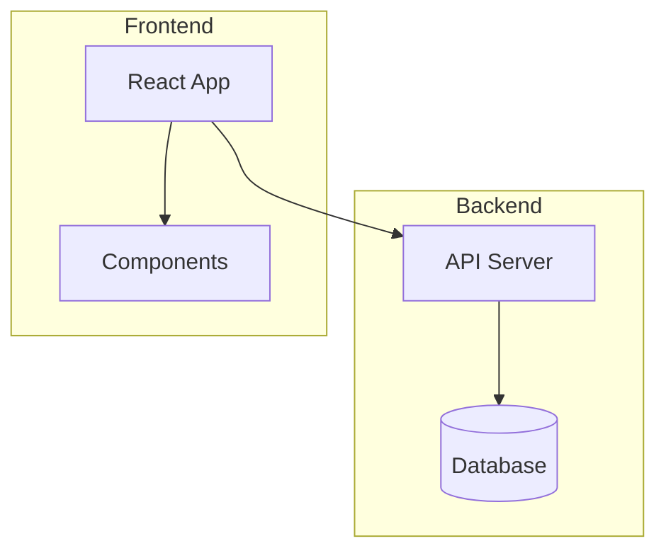

Subgraphs can have their own direction:
```
subgraph Name
    direction LR
    ...
end
```

### Styling

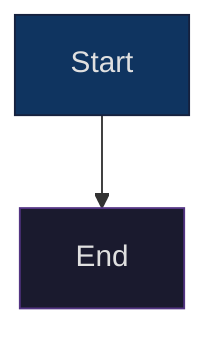

Using CSS classes:
```
classDef highlight fill:#f9f,stroke:#333,stroke-width:2px
A:::highlight --> B
```

### Complete Example

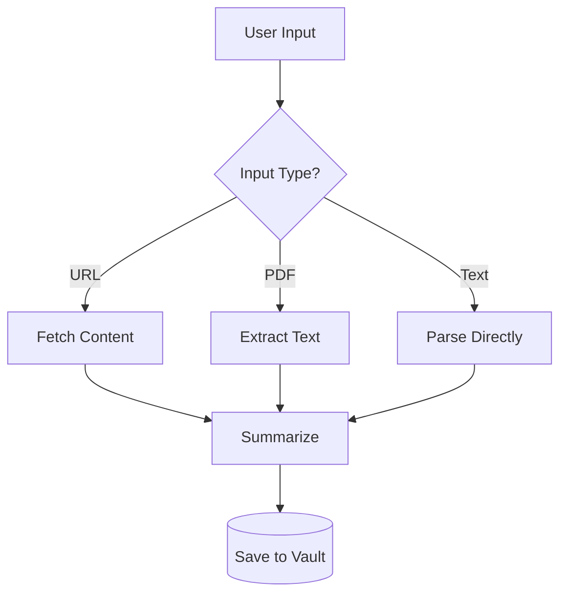

---

## 2. Mindmap

Best for hierarchical concept decomposition. **Obsidian fully supports this.**

### Syntax Rules

- Declare with `mindmap` (no direction keyword)
- Root node uses `root((...))` for circle or just `root(text)`
- **Indentation = hierarchy** (spaces only)
- ⚠️ **NEVER use `- ` or `* ` list markers**

### Node Shapes in Mindmap

```
root((Circle Root))
    Square node
    (Rounded)
    [Square]
    ))Bang((
    )Cloud(
```

### Complete Example

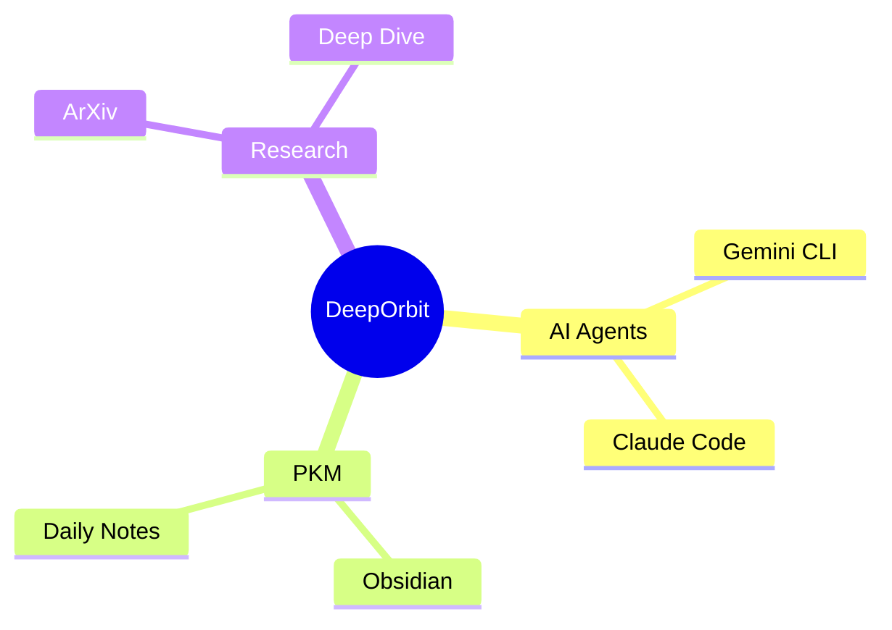

---

## 3. Sequence Diagram

Describes interactions between actors/objects over time.

### Syntax

```
sequenceDiagram
    participant A as Alice
    participant B as Bob
    A->>B: Sync message (solid arrow)
    B-->>A: Async reply (dashed arrow)
    A-)B: Async message (open arrow)
```

### Arrow Types

| Syntax | Description |
|--------|-------------|
| `->>`  | Solid line with arrowhead |
| `-->>` | Dashed line with arrowhead |
| `-)`   | Solid line with open arrow |
| `--)`  | Dashed line with open arrow |
| `->`   | Solid line without arrowhead |
| `-->`  | Dashed line without arrowhead |

### Features

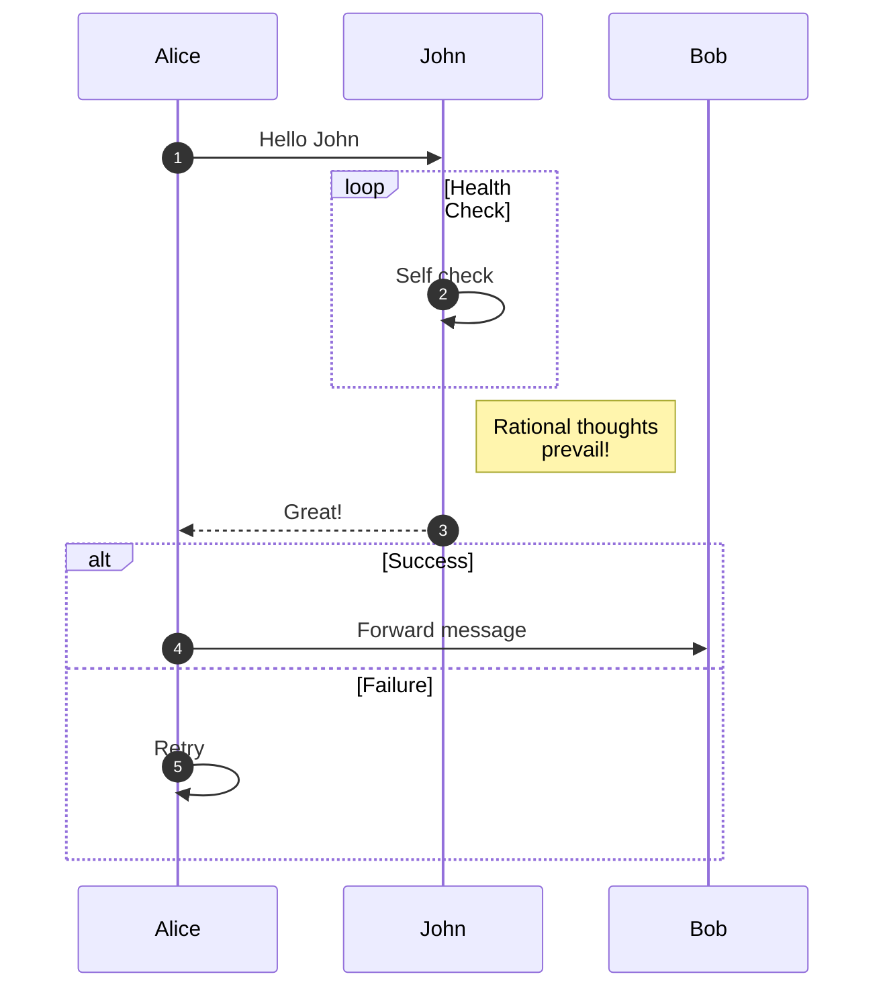

**Blocks:** `loop`, `alt/else`, `opt`, `par/and`, `critical/option`, `break`, `rect` (highlight), `Note left of/right of/over`

---

## 4. Gantt Chart

Project schedules with task dependencies.

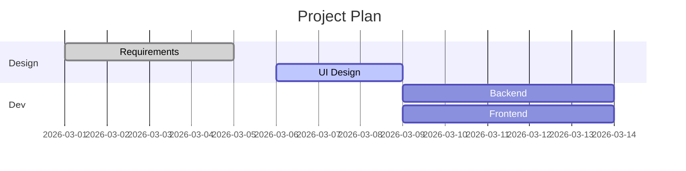

### Task Status Keywords

| Keyword | Description |
|---------|-------------|
| `done` | Completed |
| `active` | In progress |
| `crit` | Critical path |
| (none) | Future/planned |

---

## 5. State Diagram

System states and transitions.

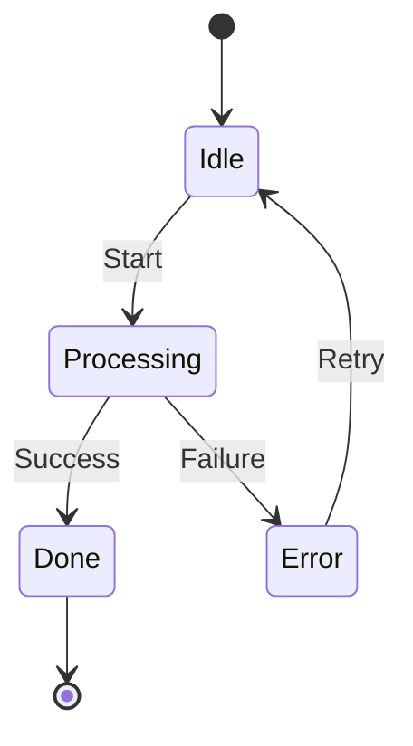

`[*]` = start/end pseudo-state. Supports `state "label" as s1`, composite states, forks, and notes.

---

## 6. Class Diagram

OOP class modeling with relationships.

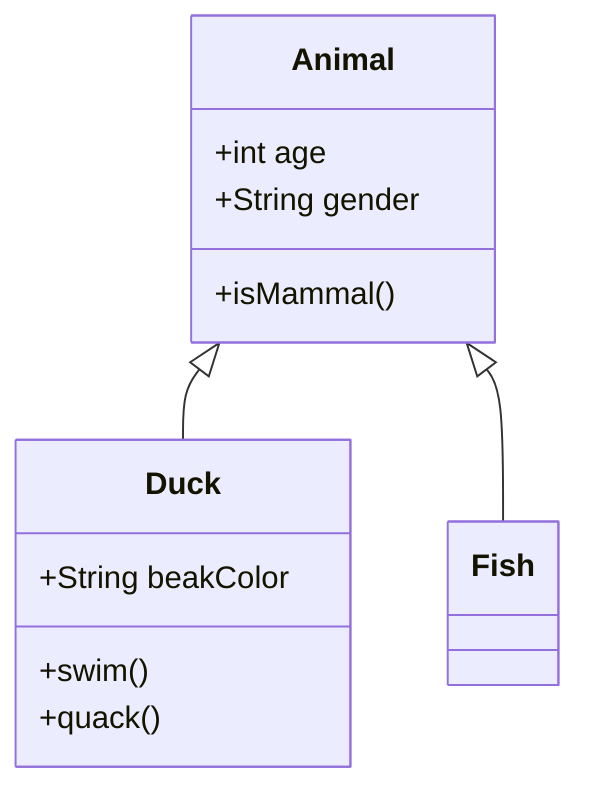

### Relationship Types

| Syntax | Meaning |
|--------|---------|
| `<\|--` | Inheritance |
| `*--` | Composition |
| `o--` | Aggregation |
| `-->` | Association |
| `..>` | Dependency |
| `..\|>` | Realization |

---

## 7. ER Diagram

Database entity-relationship modeling.

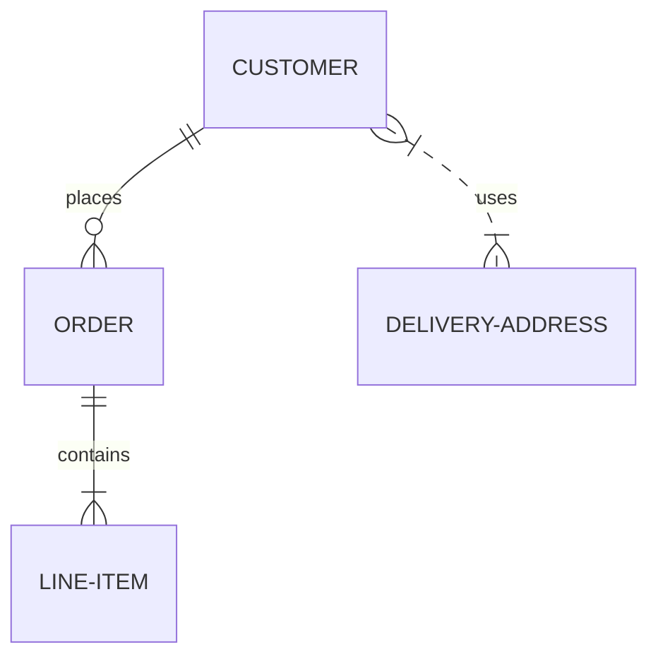

### Cardinality Notation

| Symbol | Meaning |
|--------|---------|
| `\|\|` | Exactly one |
| `o\|` | Zero or one |
| `}o` | Zero or more |
| `}\|` | One or more |

---

## 8. User Journey

User experience paths with satisfaction scores (1-5).

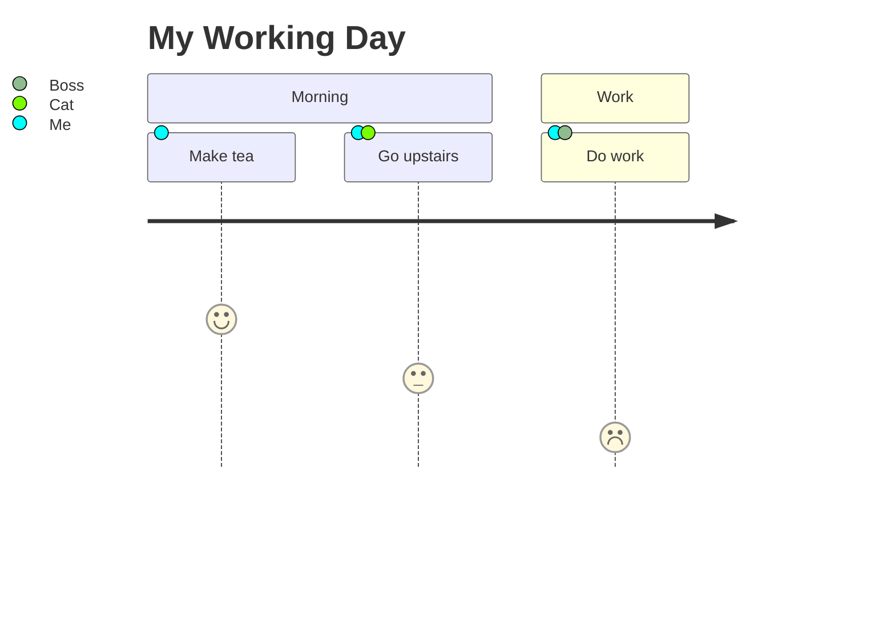

---

## 9. Quadrant Chart

2D positioning for priority/evaluation matrices.

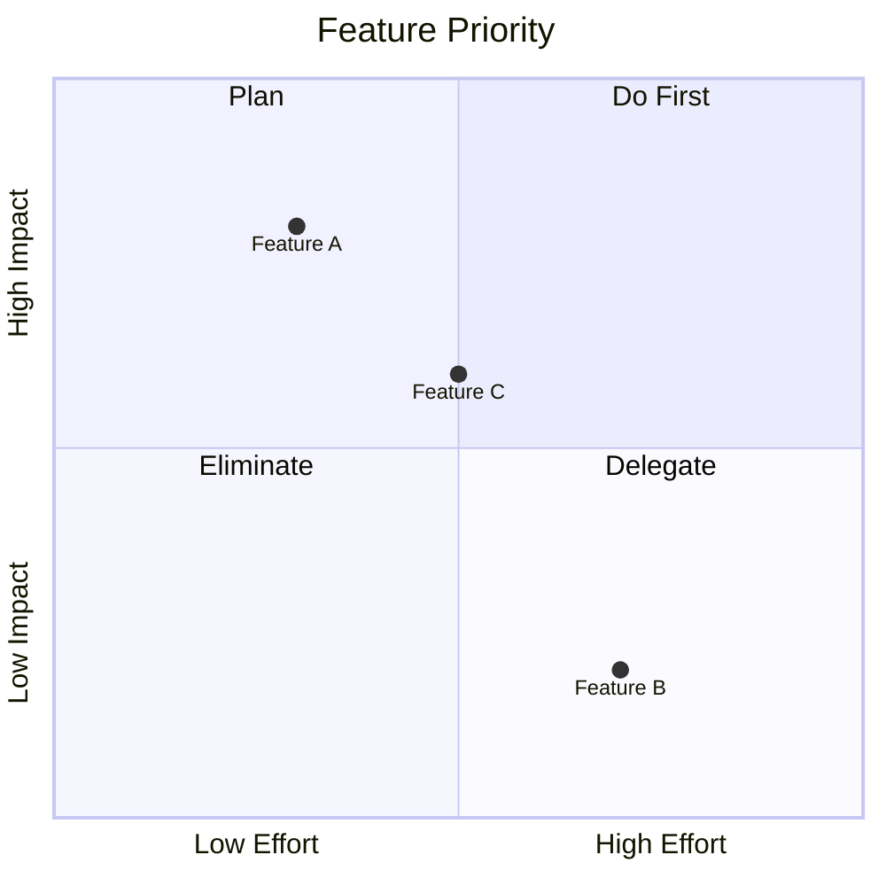

Coordinates are `[x, y]` where both axes range from `0` to `1`.

---

## 10. Timeline

Historical events and milestones.

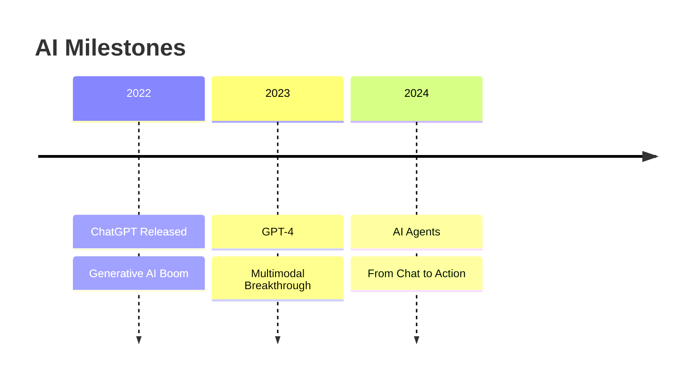

Format: `Year : Event1 : Event2`. Uses indentation for sections.

---

## 11. Git Graph

Branch and merge visualization.

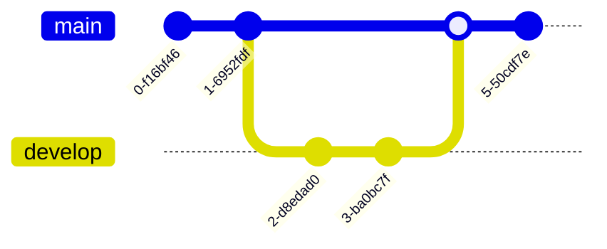

Commands: `commit`, `branch`, `checkout`, `merge`, `cherry-pick`. Supports `commit id: "msg"` and `commit tag: "v1.0"`.

---

## 12. Pie Chart

Proportional data distribution.

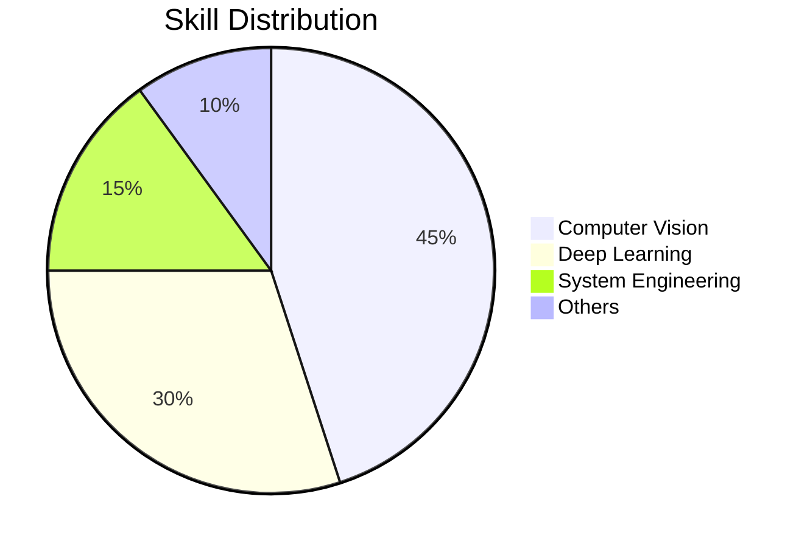

---

## 13. XY Chart (Beta)

Numerical trends with bar and line plots.

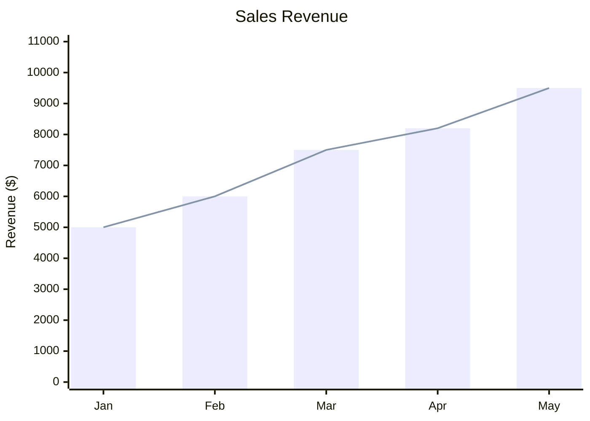

---

## 14. Kanban

Task board with workflow columns.

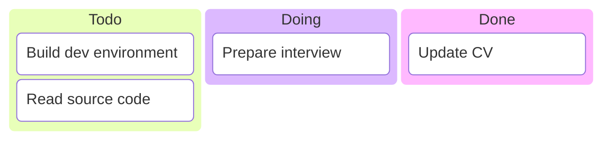

Columns are top-level labels. Tasks use `[Task name]` with indentation.

---

## Common Pitfalls

| Problem | Wrong | Correct |
|---------|-------|---------|
| Missing pipe on conditional edge | `A --> Yes B` | `A -->\|Yes\| B` |
| Full-width punctuation in code | `A[启动，运行]` | `A["Start, Run"]` |
| List markers in mindmap | `- Child node` | `  Child node` (indent with spaces) |
| Unquoted special chars in labels | `A[Label (v2)]` | `A["Label (v2)"]` |
| Wrong direction keyword | `flowchart top-down` | `flowchart TD` |

## References

- [Mermaid Official Docs](https://mermaid.js.org/)
- [Flowchart Syntax](https://mermaid.js.org/syntax/flowchart.html)
- [Sequence Diagram](https://mermaid.js.org/syntax/sequenceDiagram.html)
- [Class Diagram](https://mermaid.js.org/syntax/classDiagram.html)
- [State Diagram](https://mermaid.js.org/syntax/stateDiagram.html)
- [ER Diagram](https://mermaid.js.org/syntax/entityRelationshipDiagram.html)
- [Gantt Chart](https://mermaid.js.org/syntax/gantt.html)
- [Mindmap](https://mermaid.js.org/syntax/mindmap.html)
- [Timeline](https://mermaid.js.org/syntax/timeline.html)
- [Quadrant Chart](https://mermaid.js.org/syntax/quadrantChart.html)
- [XY Chart](https://mermaid.js.org/syntax/xyChart.html)
- [Kanban](https://mermaid.js.org/syntax/kanban.html)
- [Git Graph](https://mermaid.js.org/syntax/gitgraph.html)
