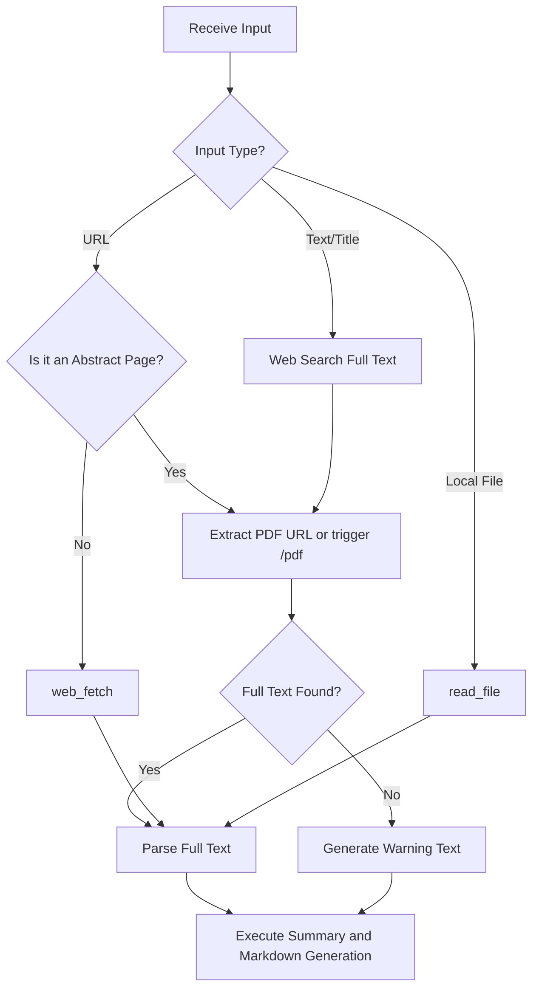

# Note Summary Skill

## Objective

When a user invokes the `/do:note_summary <URL or File Path or Content Name>` command, the system should automatically extract the **complete core information** of the target content, perform structured summarization, identify its category, and strictly archive it according to double-linking standards into the `60_Notes` folder of the DeepOrbit system.

## Workflow

### 1. Strict Content Fetching

**Prerequisite Principle:** It is absolutely forbidden to summarize content based solely on web abstracts, titles, or metadata. The system must obtain the underlying, most original content carrier (full PDF, complete subtitle file, or raw text).

1.  **Target Type: URL Link**
    Interception and Validation: Parse the URL structure.
    If it's a research paper, execute the paper-related steps in "2."
    If it's an audio/video, execute the audio/video-related steps in "3."

2.  **Target Type: Paper Title / Topic**
    **Step 1: Rights Verification & Mapping:** Call Google Search for fact-checking to establish a unique mapping relationship from Title to Document ID/URL.
    **Step 2: ArXiv Tracing Rule:** Prioritize visiting the `/abs/` page to verify paper metadata, then the system manually constructs and navigates to the `/pdf/` download page. Blindly guessing PDF links is prohibited.
    **Step 3: Quality Check (Computer Vision Specific Control):** After obtaining the PDF, check the file size. If it's a CV paper and the size is < 1MB, trigger an anomaly alert and force re-validation of link validity.
    **Error Handling:** If, after two deep retries, only an abstract text is obtained, the following bold warning must be forcibly inserted at the very top of the final output:
    ⚠️ **Warning: Full text not found. This summary is based solely on the abstract.**

3.  **Target Type: Audio/Video Topic / Name**
    **Step 1: Link Validation:** Use search or browser control tools to locate the target URL, cross-referencing metadata to confirm the topic is correct.
    **Step 2: Tiered Content Extraction (Penetrate Down by Priority):**
    **Priority 1 (Optimal Solution):** Call the `yt-dlp skill`, referring to the subtitles section, to directly extract original Chinese/English/other available language subtitle files (`.rst` / `.txt`). If successful, the process terminates; if it fails, proceed to Priority 2.
    **Priority 2 (Browser Intervention):** Take over browser control, directly click the download button via the `vCaptions` plugin, and export the original `.rst` / `.txt` file. If it fails, proceed to Priority 3.
    **Priority 3 (Low-level Fallback):** Call `download_audio` to download the raw audio stream. If the audio duration exceeds half an hour, chunk it into half-hour segments, use `transcribe_audio` for each chunk, then merge the texts. Otherwise, directly use `transcribe_audio` for speech-to-text conversion.
    **Error Handling:** If, after traversing the above three logical layers, audio or subtitle files still cannot be extracted, report an error and stop.

4.  **Target Type: Local File / Directory Path**
    **Execution Logic:** Detect the target path's attributes. If it's a single file, directly call `read_file`; if it's a folder, recursively traverse all supported files within the directory, concatenate them into a single data stream in memory, and then read them uniformly.

### 2. Intelligent Extraction and Categorization

-   **Title Recognition:** Automatically extract a suitable main title from the web page `<title>`, the first line of content, or the filename.
-   **Category Judgment (Category):** Automatically identify the category based on content, for example:
    -   `论文` (Academic, Research Report)
    -   `播客` (Interview Dialogue, Long-form Audio Transcript)
    -   `视频` (YouTube Summary, Documentary Narration)
    -   `文章` (Blog, News, Technical Tutorial)

### 3. File Archiving and Structuring

-   **Storage Location:** All generated summary notes must be placed in the `60_Notes/<Category>/<主标题>/` directory.
-   **Naming Convention:** The summary file itself must be named `<主标题>_summary.md`.
-   **Original Content Handling:** If the target is a local file, move or copy it to the same level as `<主标题>_summary.md`. Establish a double link in the summary note via the `source` property.
-   ⚠️ **Note:** If the original audio file of a video or podcast is downloaded, the **complete subtitle file** (unabridged srt or txt, etc.) should be used as the `source`. The audio file does not need to be retained because `.m4a` files are too large.
    -   **Example:** For the paper "Attention Is All You Need", the archiving structure must be:
        -   `60_Notes/论文/Attention Is All You Need/Attention Is All You Need_summary.md`
        -   `60_Notes/论文/Attention Is All You Need/Attention Is All You Need.pdf`

### 4. Output Template & Linking

#### Thinking Requirements:

-   Please first decompose knowledge using first principles. Find the most original physical laws, basic axioms, or facts within the content, and logically deduce step by step. Try to infer new paths.
-   Please use your rationality as much as possible, thinking in long chains step by step. Do not over-empathize or flatter; remember that facts are above emotions. Use Socratic questioning to stimulate my thinking.
-   It is necessary to ensure the summary is as truthful and reliable as possible, adding necessary sources, such as timestamps for podcast subtitles, and section/paragraph numbers for papers.
-   Please remember: intelligently select and output Mermaid diagrams based on context (using ```mermaid code blocks), limited to the following two types:
    1.  **Flowchart:** Suitable for logical flow, step-by-step decisions. Declare: `flowchart TD` (preferred) or `flowchart LR`.
    2.  **Mindmap:** Suitable for hierarchical expansion, concept decomposition. Declare: `mindmap`.
        ⚠️ **High-risk error:** Conditional connections must include double pipe symbols, strictly formatted as `A -->|Condition| B`. Hierarchical structure can only be achieved through pure space indentation. Absolutely forbidden to use list symbols like `- ` or `* `.
        🚨 **Global Syntax Redline:** Absolutely no full-width punctuation marks (e.g., ，。！（）) are allowed within code blocks. All parentheses, punctuation, and logical symbols must be in English half-width format!

#### Format Template:

Strictly output the summary according to the following Markdown template. Core concepts must be identified in the summary, and `[[Concept Name]]` form should be actively used to link to `40_Wiki`.

```markdown
---
type: note
title: "<Automatically Extracted Title>"
category: "<Category>"
date: YYYY-MM-DD
source: "[[<Original Filename.ext>]]"
tags:
  - <Tag1>
---

# <Automatically Extracted Title> Summary

> Core Abstract: Summarize the most core (decomposed by first principles) value or main idea of this content in 1-2 sentences.

## 1. Key Insights

- <Insight One>: Concise explanation.
- <Insight Two>: Concise explanation.

## 2. Detailed Structure / Key Discussions

### <Subheading A>

- <Key Content Point + Source>
- <Mermaid Diagram>

### <Subheading B>

- <Key Content Point + Source>

## 3. Socratic Questions

(Pose 1-2 reflective questions that get to the essence here)

## 4. Related Concepts (Knowledge Base Links)

- [[Related Concept 1]]: Why it is related to this content.
```

### 5. Special Handling for Papers (Strict Citation Double-Linking Standard)

For papers, `/pdf` or search tools must be used to discover their citation relationships. If related articles exist in `60_Notes`, **precise double links with specific directory paths** must be used.

🚨 **Syntax Redline:** Do not use `[[Paper Name]]` alone. All paper citation double links must strictly follow the format `[[<Paper Name>_summary|<Paper Name>]]`.

**Output Example:**
**References:**

- [[Attention Is All You Need_summary|Attention Is All You Need]]
- [[MoGe-2_summary|MoGe-2]]

**Cited By:**

- DepthAnything-v2 (Title only)

### System Logic Breakdown Diagram (Mermaid)


