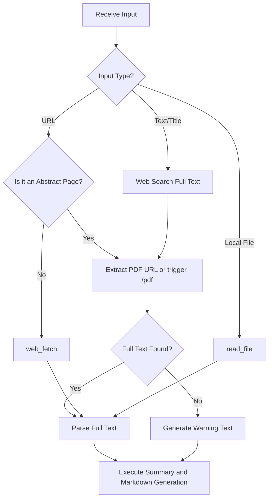

# Note Summary Skill

## 目标 (Objective)
当用户调用 `/note_summary <URL或文件路径或内容名称>` 命令时，能够自动提取目标内容的**完整核心信息**，进行结构化总结，识别分类，并严格按照双链规范归档至 OrbitOS 系统的 `60_笔记` 文件夹中。

## 工作流 (Workflow)

### 1. 强制全文获取与解析 (Strict Content Fetching)
前置原则：绝对禁止仅凭网页摘要、标题或元数据进行内容总结。必须获取底层最原始的内容载体（PDF全文、完整字幕文件或原始文本）。

1. 目标类型：URL 链接
拦截与校验：解析 URL 结构。
如果是论文，执行 "2." 中的论文相关步骤
如果是音视频，执行 "3." 中的音视频相关步骤

2. 目标类型：论文名称 / 主题
第一步：确权与映射：调用 Google 搜索进行事实核查，明确 Title 到 Document ID/URL 的唯一映射关系。
第二步：ArXiv 溯源法则：优先访问 /abs/ 页面核实论文元数据，随后由系统手动构造并跳转至 /pdf/ 下载页，禁止直接盲猜 PDF 链接。
第三步：质量校验（计算机视觉类特控）：获取 PDF 后检查文件体积。若属于 CV 类论文且体积 < 1MB，触发异常警报，强制重新校验链接有效性。
异常处理：若经过两次深度重试仍只获取到摘要文本，必须在最终输出的最顶部强制插入以下加粗警告：
⚠️ 警告：未找到全文，当前总结仅基于摘要生成。

3. 目标类型：音视频主题 / 名称
第一步：链接验证：使用搜索或浏览器控制工具定位目标 URL，核对元数据以确认主题无误。
第二步：阶梯式内容提取（按优先级向下穿透）：
优先级 1 (最优解)：调用 yt-dlp skill，参考 subtitles 部分，直接抽取原始中/英/其他存在的语言文字幕文件 (.rst / .txt)。若成功，流程终止；若失败，进入优先级 2。
优先级 2 (浏览器介入)：接管浏览器控制权，通过 vCaptions 插件直接点击下载按钮，并导出原始 .rst / .txt 文件。若失败，进入优先级 3。
优先级 3 (底层回退)：调用 download_audio 下载原始音频流。如果音频时间超过半小时，按每半小时一chunk进行分块，使用transcribe_audio分别转文本再合并。否则直接 transcribe_audio 进行语音转文本。
异常处理：若遍历上述三层逻辑仍无法提取音频或字幕文件，报错并且停止。

4. 目标类型：本地文件 / 目录路径
执行逻辑：检测目标路径属性。若为单一文件，直接调用 read_file；若为文件夹，递归遍历目录下所有支持的文件，并将其在内存中拼接为单一数据流后统一读取。

### 2. 智能提取与分类
* 标题识别：自动从网页 `<title>`、内容首行或文件名中提取合适的主标题。
* 分类判断 (Category)：基于内容自动识别类别，例如：
    * `论文` (学术、研究报告)
    * `播客` (访谈对话、长篇音频稿)
    * `视频` (YouTube 摘要、纪录片解说)
    * `文章` (博客、新闻、技术教程)

### 3. 文件归档与结构化
* 存放位置：所有生成的总结笔记必须放置在 `60_笔记/<Category>/<主标题>/` 目录下。
* 命名规范：总结文件本身必须命名为 `<主标题>_summary.md`。
* 原文处理：如果目标是本地文件，请将其移动或复制到与 `<主标题>_summary.md` 同级的位置。在总结笔记中通过 `source` 属性建立双链。
* ⚠️ 注意：如果下载了视频或者播客的原始音频文件，需要将 **完整字幕文件**（不经删减的srt或txt等）作为source，不需要保留音频文件，因为m4a文件太大了。
    * 举例：论文《Attention Is All You Need》，归档结构必须为：
        * `60_笔记/论文/Attention Is All You Need/Attention Is All You Need_summary.md`
        * `60_笔记/论文/Attention Is All You Need/Attention Is All You Need.pdf`

### 4. 输出模板与知识关联 (Template & Linking)

#### 思考要求：
* 请首先使用第一性原理拆解知识。找到内容中最原始的物理定律，基本公理或事实，一步步逻辑推演。尝试推理出新的路径。
* 请尽可能使用你的理性，分步骤进行长链思考。请不要过分共情或者阿谀奉承，牢记事实高于情感。用苏格拉底式的提问激发我的思考。
* 需要尽可能确保总结真实可靠，添加必要的出处，如播客字幕的时间戳，以及论文的 section/段落 等。
* 请记住：根据上下文智能选择并输出 Mermaid 图表（使用 ```mermaid 代码块），仅限以下两种：
  1. 流程图 (Flowchart)：适合逻辑流转、步骤判断。声明：`flowchart TD` (优先) 或 `flowchart LR`。
  2. 思维导图 (Mindmap)：适合层级发散、概念拆解。声明：`mindmap`。
  ⚠️ 高危易错：带条件连线必须包含双管道符，格式严格为 `A -->|条件| B`。层级结构仅能通过纯空格缩进实现。绝对禁止使用 `- ` 或 `* ` 等列表符号。
🚨 全局语法红线：代码块内绝对禁止使用任何全角标点符号（如：，。！（））。所有括号、标点及逻辑符号必须为英文半角格式！

#### 格式模板：
严格按照以下 Markdown 模板输出总结。必须在总结中识别核心概念，主动使用 `[[概念名]]` 的形式关联 `40_知识库`。

```markdown
---
type: note
title: "<自动提取的标题>"
category: "<分类>"
date: YYYY-MM-DD
source: "[[<原文件名.ext>]]"
tags:
  - <标签1>
---

# <自动提取的标题> 总结

> 核心摘要：用 1-2 句话概括这篇内容最核心的（被第一性原理拆解过的）价值或主旨。

## 1. 核心观点 (Key Insights)
* <观点一>：简明扼要的解释。
* <观点二>：简明扼要的解释。

## 2. 详细结构 / 精彩讨论
### <小标题 A>
* <内容要点 + 出处>
* <mermaid 图表>
    
### <小标题 B>
* <内容要点 + 出处>
    
## 3. 苏格拉底式提问
(在此处提出 1-2 个直击本质的反思性问题)

## 4. 关联概念 (知识库链接)
* [[相关概念1]]：为什么与该内容相关。

```

### 5. 论文的特殊处理 (严格引文双链规范)

对于论文，必须使用 `/pdf` 或搜索工具发现其引用关系。如果相关文章存在于 `60_笔记` 中，必须使用**带有具体目录路径的精确双链**。

🚨 **语法红线**：禁止仅使用 `[[论文名]]`。所有的论文引用双链必须严格按照 `[[<论文名称>_summary|<论文名称>]]` 的格式输出。

**输出示例：**
**引用的文献 (References):**

* [[Attention Is All You Need_summary|Attention Is All You Need]]
* [[MoGe-2_summary|MoGe-2]]

**被引用的文献 (Cited By):**

* DepthAnything-v2 （仅列出标题）


### 系统逻辑拆解图 (Mermaid)


